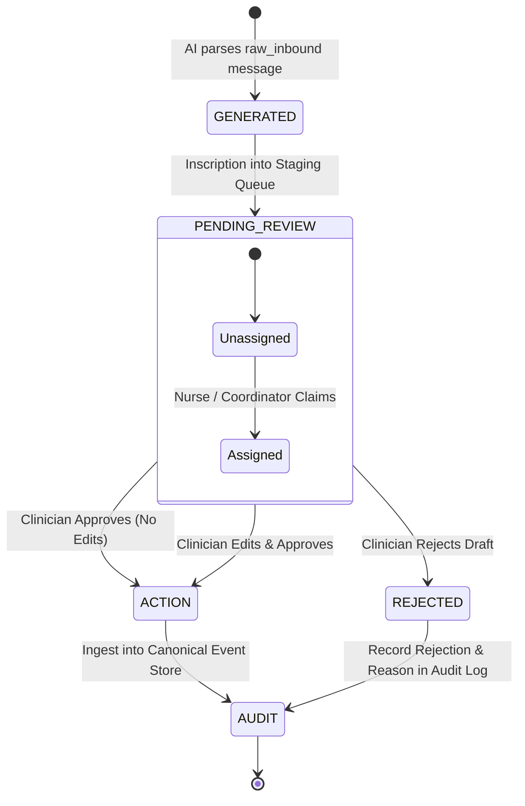
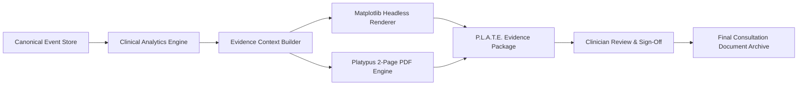

# GATE 01 — CURRENT → TARGET ARCHITECTURE RECONCILIATION
## THALI × P.L.A.T.E. PRODUCTION MIGRATION PROGRAM
**Document Status:** Architecture Design & Reconciliation Matrix  
**Gate Status:** READ-ONLY DESIGN GATE (No source code or schema modifications executed)

---

## 1. Executive Summary

This document reconciles the verified baseline codebase (**Aahaar**, audited in **GATE 00**) with the authoritative enterprise target architecture: **THALI × P.L.A.T.E.**

### 1.1 Core Problem Statement
The current repository contains an outpatient glycemic context prototype designed for single-facility hackathon demonstration. It features strong domain parsing, clinical safety guardrails, volumetric nutritional calculations, and publication-grade PDF reporting. However, it lacks enterprise multi-tenancy, cryptographic identity, role-based access control, a canonical event bus, a mobile application tier, and safe asynchronous AI human-in-the-loop workflows.

### 1.2 Reconciliation Mandate
This gate establishes a non-destructive, phased migration plan that transitions the Aahaar codebase into the unified THALI × P.L.A.T.E. platform:
1. **Preserve High-Value Domain Logic**: Retain and wrap the deterministic regex parsing, Indian nutritional taxonomy, Time-in-Range (TIR) metrics, and ReportLab Platypus rendering engines.
2. **Eliminate Prototype Hazards**: Remove autonomous database writes from AI background workers, abolish prototype single-patient phone auto-rebinding, and remediate unauthenticated clinical data access.
3. **Establish Unified Architectural Substrates**: Introduce a universal identity model, canonical event model, consent management layer, role-aware RBAC, and offline-capable mobile synchronization boundary.
4. **Avoid Big-Bang Disruption**: Deploy a phased adapter and compatibility facade allowing existing WhatsApp logging and reporting to function continuously throughout migration.

---

## 2. Target Architecture Restatement

The target architecture unifies clinical team workflows and patient self-management into **one connected system**:

```
+----------------------------------------------------------------------------------------------------+
|                                    TARGET SYSTEM EXPERIENCES                                       |
+--------------------------------------------------+-------------------------------------------------+
| APPLICATION 1: Universal Role-Aware Mobile App   | APPLICATION 2: Admin Web Console                |
| (Single codebase; dynamically adapts by role)    | (Web workstation for system operators)          |
|                                                  |                                                 |
| - Patient Experience: THALI                      | - Organization & Facility Administration        |
| - Caregiver Experience: THALI (Delegated)        | - User Management & RBAC Governance             |
| - Care Team Experience: P.L.A.T.E.               | - Consent Governance & Data Quality             |
|   (Doctor, Nurse, Coordinator, Dietitian, Worker)| - Device Management, Monitoring & Model Audit   |
+--------------------------------------------------+-------------------------------------------------+
                                                   ▲
                                                   │ HTTPS / WSS
+--------------------------------------------------┴-------------------------------------------------+
| CHANNEL: WhatsApp Business Cloud (First-Class Integration)                                         |
| (Feeds the canonical event model directly via Webhook Gateway; shared unified backend persistence) |
+--------------------------------------------------┬-------------------------------------------------+
                                                   │ HTTPS (HMAC Verified)
                                                   ▼
+----------------------------------------------------------------------------------------------------+
|                                      UNIFIED SHARED BACKEND                                        |
|                                                                                                    |
| +-------------------------+ +-------------------------+ +-------------------------+                |
| | Identity & RBAC Engine  | | Org & Facility Tenancy  | | Consent Engine          |                |
| +-------------------------+ +-------------------------+ +-------------------------+                |
| +-------------------------+ +-------------------------+ +-------------------------+                |
| | Canonical Event Store   | | Unified Patient Record  | | Offline Sync & Outbox   |                |
| +-------------------------+ +-------------------------+ +-------------------------+                |
| +-------------------------+ +-------------------------+ +-------------------------+                |
| | Deterministic Analytics | | P.L.A.T.E. Evidence     | | AI Human-in-the-Loop    |                |
| | (TIR, Slots, CVI, r)    | | (ReportLab / Charts)    | | (Review & Staging Queue)|                |
| +-------------------------+ +-------------------------+ +-------------------------+                |
| +-------------------------+ +-------------------------+ +-------------------------+                |
| | Ingestion & Confirm     | | Outbound Communications | | Immutable Audit Ledger  |                |
| +-------------------------+ +-------------------------+ +-------------------------+                |
+----------------------------------------------------------------------------------------------------+
```

### Core Architectural Invariants
1. **One Identity Model**: All actors (patients, caregivers, doctors, nurses, coordinators, dietitians, field workers, administrators) are distinct `Users` possessing cryptographically verifiable credentials.
2. **One Backend**: A single modular backend serves the universal mobile application, admin console, and WhatsApp channel adapter.
3. **One Unified Patient Record**: Longitudinal biometric telemetry, clinical notes, meal observations, and communications consolidate into a single source of truth.
4. **One Canonical Event Model**: Every patient-related transaction is represented as an immutable, timestamped canonical event.
5. **One Audit Trail**: All reads, writes, mutations, and clinical viewings are recorded in an append-only audit ledger.
6. **Role-Aware Access Control (RBAC)**: Fine-grained permissions enforced at the domain service layer based on active role context.
7. **Organization & Facility Isolation**: Multi-tenant data segregation partitioning records by organization and clinical facility.
8. **Consent-Aware Data Access**: Explicit patient consent grants govern caregiver delegation and care-team visibility.
9. **Deterministic Analytics Before AI**: Mathematical aggregations (TIR, meal-slot PPBG, CVI) execute deterministically; AI never computes core metrics.
10. **Evidence Package Before LLM Summaries**: Clinical evidence bundles (graphs, metrics, raw logs) must be compiled prior to invoking generative LLMs.
11. **Reviewable AI Outputs**: All generative outputs must traverse a strict lifecycle:  
    $$\text{GENERATED} \longrightarrow \text{PENDING REVIEW} \longrightarrow \text{APPROVE / EDIT / REJECT} \longrightarrow \text{ACTION} \longrightarrow \text{AUDIT}$$
12. **AI Never Silently Assumes Clinical Authority**: AI outputs cannot directly mutate clinical records or issue medical orders.
13. **System Remains Assistive and Non-Diagnostic**: No disease classifications, risk ratings, or drug dose calculations.
14. **Information Asymmetry Protection**: Patient interfaces omit technical clinical constructs (carbohydrate grams, GI indexes, volatility scores) in favor of calibrated household units (Small, Medium, Large katoris).
15. **Clinician-Authored Medication Workflows**: Medication plans originate solely from licensed clinicians; patients and AI only record administration events.
16. **Offline-Preserving Mobile Workflows**: Local client storage retains unsynchronized data and executes conflict-safe sync protocols.
17. **No Blanket Last-Write-Wins (LWW)**: Clinical observations must resolve conflicts via causal provenance and audit merging, not arbitrary overwrites.

---

## 3. Current Architecture Restatement (Baseline Aahaar)

The baseline system verified in Gate 00 contains:
* **Framework & Runtime**: Python 3.10+, FastAPI (`app/server/main.py`), Uvicorn ASGI server.
* **Persistence Layer**: Embedded SQLite (`aahaar.db`) with Write-Ahead Logging (`WAL`) and 10 flat tables (`patients`, `caregivers`, `avoid_items`, `windows`, `meals`, `readings`, `outbound`, `audit`, `raw_inbound`, `webhook_events`).
* **Ingress & Parsing**: Pure Python deterministic parser (`app/core/parse.py`) and nutritional taxonomy (`app/core/nutrition.py`) evaluating 35 Indian staples and household katori portions (150 ml, 220 ml, 350 ml).
* **Confirm Loop & Guards**: Process pipeline (`app/core/process.py`) managing meal proposals, affirmative confirmations (`yes`), portion adjustments, and a binary phone-based role guard.
* **Analytics**: Descriptive metrics engine (`app/core/metrics.py`) calculating TIR (70–180 mg/dL), Adherence Index, meal-slot PPBG (PB, PL, PD), Weekday vs. Weekend deltas, CVI, and Pearson correlation ($r$).
* **Reporting**: ReportLab Platypus engine (`app/report/pdf.py`) and headless Matplotlib (`app/report/charts.py`) rendering a 2-page A4 PDF and HTML mirror preview (`app/report/html_preview.py`).
* **Channel Integration**: Channel abstraction (`app/server/whatsapp.py`) supporting local console simulator and Meta WhatsApp Cloud API (Graph API v21.0).
* **AI Subsystem**: Decoupled background worker (`app/core/ai_worker.py`) running Google Gemini REST queries (`app/core/ai.py`, `app/core/intake_ai.py`) for missing field collection.
* **Frontend**: Prototype single-page dashboard (`app/static/`) built with vanilla JavaScript, CSS3, and HTML5, polling endpoints every 3000 ms.
* **Automated Tests**: 57 integration and unit tests (`tests/test_pipeline.py`, `tests/test_linking.py`) protecting clinical safety invariants.

---

## 4. Current → Target Subsystem Mapping

```
+----------------------------------------------------------------------------------------------------+
|                                    SUBSYSTEM MAPPING MATRIX                                        |
+------------------------------+----------------------------------+----------------------------------+
| Current Aahaar Component     | Target Architecture Component    | Architectural Evolution Strategy |
+------------------------------+----------------------------------+----------------------------------+
| Inbound Regex & Normalizer   | Canonical Event Parsing Service  | WRAP & MOVE: Preserve regex and  |
| (app/core/parse.py)          | (services/event_parser/)         | normalizers inside canonical bus.|
+------------------------------+----------------------------------+----------------------------------+
| Indian Nutrition Taxonomy    | Clinical Nutrition Service       | KEEP & MOVE: Pure Python logic   |
| (app/core/nutrition.py)      | (services/nutrition/)            | migrated intact to domain core.  |
+------------------------------+----------------------------------+----------------------------------+
| Confirm Loop & Role Guard    | Intake Workflow Service          | REFACTOR: Generalize confirm     |
| (app/core/process.py)        | (services/workflows/intake/)     | loop; replace phone role guard.  |
+------------------------------+----------------------------------+----------------------------------+
| Metrics & Chronobiology      | Clinical Analytics Engine        | KEEP & MOVE: Maintain descriptive|
| (app/core/metrics.py)        | (services/analytics/)            | formulas (TIR, slots, CVI, r).   |
+------------------------------+----------------------------------+----------------------------------+
| ReportLab PDF & Charts       | P.L.A.T.E. Evidence Service      | KEEP & WRAP: Adapt into report   |
| (app/report/*)               | (services/reporting/evidence/)   | generator fed by canonical events|
+------------------------------+----------------------------------+----------------------------------+
| Operational 21:00 Nudge      | Care Coordination Worker         | REFACTOR: Port into scheduled    |
| (app/core/escalation.py)     | (workers/care_coordination/)     | background task worker.          |
+------------------------------+----------------------------------+----------------------------------+
| Meta WhatsApp Client         | WhatsApp Channel Adapter         | WRAP & SECURE: Add HMAC-SHA256   |
| (app/server/whatsapp.py)     | (channels/whatsapp/)             | verification & async outbox.     |
+------------------------------+----------------------------------+----------------------------------+
| SQLite Store-First Engine    | Canonical Event Store (Postgres) | REPLACE: Migrate to PostgreSQL   |
| (app/core/datamodel.py)      | & Compatibility Facade           | with dual-write compatibility.   |
+------------------------------+----------------------------------+----------------------------------+
| Autonomous AI Worker         | AI Human-in-the-Loop Gateway     | REFACTOR: Remove auto-writes;    |
| (app/core/ai_worker.py)      | (services/ai/staging_queue/)     | enforce staging review queue.    |
+------------------------------+----------------------------------+----------------------------------+
| Single-Page Web Dashboard    | Admin Console & P.L.A.T.E. Web   | DEPRECATE & REPLACE: Replaced by |
| (app/static/*)               | Workstation (React / Next.js)    | universal mobile app and web console.|
+------------------------------+----------------------------------+----------------------------------+
```

---

## 5. File-by-File Migration Matrix

| Source File Path | Target Architecture Classification | Target Architecture Destination | Detailed Architectural Rationale ("WHY") |
| :--- | :--- | :--- | :--- |
| `app/config.py` | **SPLIT & MODIFY** | `core/config/` | Split monolithic settings into modular configs: `AuthConfig`, `DatabaseConfig`, `ChannelConfig`, `ClinicalConfig`. Remove hardcoded secrets (`operator_key`, test phone numbers). |
| `app/core/datamodel.py` | **REPLACE & WRAP** | `infrastructure/persistence/` | Replace raw SQLite schema with PostgreSQL models (SQLAlchemy / SQLModel) and Alembic migrations. Retain temporary SQLite wrapper during Phase 1 for backwards compatibility. |
| `app/core/nutrition.py` | **KEEP & MOVE** | `domain/nutrition/` | High-value, pure Python domain asset. Lacks external dependencies, highly tested, contains clinical katori densities and 35 Indian staple mappings. |
| `app/core/parse.py` | **KEEP & MOVE** | `domain/nlp/parser.py` | High-performance regex parser with ambiguity detection. Preserved to convert unstructured patient speech/text into structured canonical observation candidates. |
| `app/core/process.py` | **SPLIT & MODIFY** | `application/workflows/intake.py` | Decouple routing from persistence. Strip out the prototype single-patient auto-adopt hack (lines 65–73). Replace primitive role check with unified RBAC service calls. |
| `app/core/metrics.py` | **KEEP & MOVE** | `domain/analytics/engine.py` | Production-grade mathematical analytics. Operates deterministically without LLM hallucination risk. Direct drop-in into the clinical analytics layer. |
| `app/core/report.py` | **MODIFY & MOVE** | `application/reporting/context.py` | Refactor context builder to read from the Unified Patient Record and Canonical Event Model instead of direct SQLite queries. Maintain descriptive non-diagnostic phrasing. |
| `app/core/escalation.py` | **MODIFY & MOVE** | `infrastructure/workers/nudges.py` | Transform synchronous function into an asynchronous Celery/Arq background task. Retain daily unique key idempotency and caregiver-first routing logic. |
| `app/core/seed.py` | **DEPRECATE & REMOVE** | `tests/fixtures/seed_data.py` | Prototype seeding logic ("Sunita Devi") has no place in production source tree. Convert into structured test fixtures and development database seeders. |
| `app/core/ai.py` | **MERGE & MODIFY** | `infrastructure/ai/gemini_client.py` | Merge with `intake_ai.py`. Encapsulate Google Gemini REST communication, model discovery, and exponential backoff retry. Retain local regex refiner as offline fallback. |
| `app/core/intake_ai.py` | **MERGE & MODIFY** | `domain/ai/intake_assistant.py` | Merge into domain AI services. Retain non-diagnostic clinical prompt boundaries. Ensure output produces draft candidate events rather than direct database mutations. |
| `app/core/ai_worker.py` | **REPLACE & REFACTOR** | `infrastructure/workers/ai_intake.py`| Strip out autonomous calls to `store.add_reading()` and `store.propose_meal()`. Output must land in `ai_draft_queue` requiring human clinician or patient sign-off. |
| `app/report/charts.py` | **KEEP & MOVE** | `infrastructure/reporting/charts.py` | Headless 270 DPI Matplotlib charting logic is clean, robust, and pillow-safe. Move intact to the P.L.A.T.E. visualization provider. |
| `app/report/pdf.py` | **KEEP & MOVE** | `infrastructure/reporting/pdf.py` | Lab-grade ReportLab Platypus implementation. Represents the primary P.L.A.T.E. document artifact. Move intact; update context provider interface. |
| `app/report/html_preview.py`| **MODIFY & MOVE** | `infrastructure/reporting/html.py` | Refactor HTML/CSS mirror to serve as an embedded webview provider for both the P.L.A.T.E. web console and mobile application. |
| `app/server/main.py` | **SPLIT & REFACTOR** | `interfaces/api/v1/` | Deconstruct monolithic 622-line file into modular FastAPI routers (`auth.py`, `patients.py`, `telemetry.py`, `reports.py`, `webhooks.py`, `diagnostics.py`). |
| `app/server/whatsapp.py` | **MODIFY & WRAP** | `interfaces/channels/whatsapp/` | Enhance `CloudBackend` by implementing mandatory Meta `X-Hub-Signature-256` HMAC validation. Retain `SimulatorBackend` for headless integration tests. |
| `app/static/*` | **DEPRECATE & REPLACE** | `clients/web_admin/` | Prototype single-page dashboard cannot support multi-tenant RBAC or mobile workflows. Retain temporarily as legacy debug console; replace with React/Next.js console. |
| `scripts/demo.py` | **MOVE & ADAPT** | `tests/e2e/simulation_runner.py` | Valuable end-to-end simulation tool. Adapt to generate synthetic traffic across the canonical event bus to benchmark analytics and reporting pipelines. |
| `scripts/seed_real.py` | **REMOVE** | N/A | Prototype hack for overriding demo phone numbers. Superseded by Admin Console user onboarding and patient phone verification. |
| `scripts/analyze_stored.py`| **MODIFY & MOVE** | `interfaces/cli/batch_analyzer.py` | Refactor into an administrative batch CLI command operating through domain services with proper tenant filtering. |
| `tests/conftest.py` | **MODIFY** | `tests/conftest.py` | Expand test fixtures to support multi-tenant database sessions, JWT auth headers, and canonical event generation. |
| `tests/test_pipeline.py` | **KEEP & ADAPT** | `tests/domain/test_safety_invariants.py`| 41 critical tests verifying clinical safety invariants. Must remain 100% green throughout all migration phases. |
| `tests/test_linking.py` | **MODIFY & ADAPT** | `tests/interfaces/test_whatsapp_channel.py`| Adapt phone linking tests to verify cryptographic authentication, user identity resolution, and channel routing. |

---

## 6. Application Boundary Reconciliation

```
+----------------------------------------------------------------------------------------------------+
|                                  APPLICATION BOUNDARY ALLOCATION                                   |
+-------------------------+--------------------------------------------------------------------------+
| Target Application      | Concrete Allocated Responsibilities & Features                           |
+-------------------------+--------------------------------------------------------------------------+
| 1. Universal Mobile App | - Single binary / codebase adapting by authenticated role.               |
|    (THALI Experience)   | - Role: Patient / Caregiver:                                             |
|                         |   * Conversational telemetry logging (meal photos, text, voice notes).   |
|                         |   * Volumetric plate proposal verification (Small, Medium, Large katori).|
|                         |   * Simplified adherence visualization and medication checklists.        |
|                         |   * Zero exposure of technical carbs, GI numbers, or predictive ratings. |
|                         | - Local offline SQLite / Outbox storage with background sync engine.     |
+-------------------------+--------------------------------------------------------------------------+
| 1. Universal Mobile App | - Role: Doctor / Nurse / Care Coordinator / Dietitian / Field Worker:    |
|    (P.L.A.T.E. Exp.)    |   * Consultation readiness view & unified patient journey timeline.      |
|                         |   * Comprehensive glycemic context: TIR (70-180), FPG, PPBG slot means.  |
|                         |   * Chronobiology breakdown (Weekday vs. Weekend excursion deltas).      |
|                         |   * Nutrition analysis: High-GI share (%), Carb Volatility Index (CVI).  |
|                         |   * On-screen 2-page report preview & high-res PDF generation/export.    |
|                         |   * Review & approval queue for AI-suggested intake drafts.              |
|                         |   * Authoring and modification of medication instruction plans.          |
+-------------------------+--------------------------------------------------------------------------+
| 2. Admin Web Console    | - Multi-tenant management: Organizations, Facilities, Departments.       |
|                         | - Identity & Access: User provisioning, role assignment, credential reset.|
|                         | - Consent Governance: Patient data access grant & delegation auditing.   |
|                         | - System Observability: Webhook event monitors, Meta WABA subscription.  |
|                         | - AI Governance: Staging queue auditing, model discovery, token metrics. |
+-------------------------+--------------------------------------------------------------------------+
| 3. WhatsApp Channel     | - First-class asynchronous communication interface.                      |
|                         | - Ingests patient meal photos, colloquial text, and glucometer readings. |
|                         | - Executes the two-way confirm loop via interactive buttons/templates.   |
|                         | - Dispatches 21:00 operational nudges to designated caregivers.          |
|                         | - Publishes raw payloads directly to the Canonical Event Bus.            |
+-------------------------+--------------------------------------------------------------------------+
| 4. Shared Backend Core  | - Unified REST API & WebSocket gateways (FastAPI).                       |
|                         | - Domain Services: Identity, RBAC, Nutrition, Analytics, Reporting.      |
|                         | - Persistence: Canonical Event Store, Unified Patient Record (Postgres). |
|                         | - Task Queue: Celery/Redis for AI intake, nudges, and PDF generation.    |
|                         | - Centralized Immutable Audit Ledger.                                    |
+-------------------------+--------------------------------------------------------------------------+
```

### Strategy for Existing Vanilla JS Dashboard (`app/static/`)
* **Status**: **TEMPORARY LEGACY / DEBUG INTERFACE**.
* **Migration Strategy**:
  1. *Phase 1*: Retain `app/static/` mounted at `/legacy` or `/dashboard` behind basic authentication to maintain operational parity during backend refactoring.
  2. *Phase 2*: Build the target Admin Web Console (React/Next.js) for operator and diagnostic workflows. Build the universal mobile application (Flutter / React Native) for patient and clinical workflows.
  3. *Phase 3*: Deprecate `app/static/` routes.
  4. *Phase 4*: Fully delete `app/static/app.js`, `index.html`, and `style.css` from the repository.

---

## 7. Domain Model Reconciliation

```
+----------------------------------------------------------------------------------------------------+
|                                    DOMAIN RECONCILIATION MAPPING                                   |
+-----------------------+----------------------------------+-----------------------------------------+
| Existing Concept      | Target Enterprise Concept        | Conceptual Evolution & Transformation   |
+-----------------------+----------------------------------+-----------------------------------------+
| `patients`            | `Patient` (extends `User`)       | Becomes a specialized profile linked to |
|                       |                                  | a core `User` identity. Scoped to an    |
|                       |                                  | `Organization` and primary `Facility`.  |
+-----------------------+----------------------------------+-----------------------------------------+
| `caregivers`          | `CaregiverRelationship` &        | Disentangled from raw phone strings.    |
|                       | `ConsentGrant`                   | Caregiver becomes a distinct `User`     |
|                       |                                  | with an explicit delegated consent grant|
|                       |                                  | and care-team relationship record.      |
+-----------------------+----------------------------------+-----------------------------------------+
| `windows`             | `CarePlanInterval` /             | Shift from rigid 14-day tracking blocks |
|                       | `AssessmentWindow`               | to dynamic clinical care plans with     |
|                       |                                  | configurable goals and review milestones|
+-----------------------+----------------------------------+-----------------------------------------+
| `meals`               | `MealEvent` (specialization of   | Re-architected as an immutable canonical|
|                       | `CanonicalEvent`)                | event with payload containing detected   |
|                       |                                  | items, volumetric portion, and status.  |
+-----------------------+----------------------------------+-----------------------------------------+
| `readings`            | `ObservationEvent` (specialized  | Generalized biometric observation with  |
|                       | as `glucose_measurement`)        | type (`fpg`, `ppbg`), units (`mg/dL`),  |
|                       |                                  | device metadata, and meal association.  |
+-----------------------+----------------------------------+-----------------------------------------+
| `raw_inbound`         | `CommunicationEvent` (channel:   | Raw speech/text stored immutably as     |
|                       | `whatsapp` or `mobile_chat`)     | communication events with provenance,   |
|                       |                                  | payload, and downstream event links.    |
+-----------------------+----------------------------------+-----------------------------------------+
| `outbound`            | `DispatchEvent`                  | Outbound templates and notifications    |
|                       |                                  | tracked in unified communication ledger.|
+-----------------------+----------------------------------+-----------------------------------------+
| `webhook_events`      | `ChannelTelemetryEvent`          | System observability event capturing    |
|                       |                                  | gateway latency, IP, status, and payload|
+-----------------------+----------------------------------+-----------------------------------------+
| `avoid_items`         | `DietaryDirective`               | Clinician-authored dietary rules stored |
|                       |                                  | within patient's active Care Plan.      |
+-----------------------+----------------------------------+-----------------------------------------+
| Report Context / PDF  | `EvidencePackage` &              | Structured clinical evidence bundle with|
|                       | `ClinicalDocument`               | cryptographic hash, audit linkage, and  |
|                       |                                  | permanent document store archival.      |
+-----------------------+----------------------------------+-----------------------------------------+
| `refined_json` (AI)   | `AIDraftCandidate`               | Staged AI suggestion requiring human sign|
|                       |                                  | off before generating a canonical event.|
+-----------------------+----------------------------------+-----------------------------------------+
| N/A (New Target)      | `MedicationPlan` &               | Clinician-authored prescription orders  |
|                       | `MedicationAdministrationEvent`  | and patient-logged adherence check-ins. |
+-----------------------+----------------------------------+-----------------------------------------+
| N/A (New Target)      | `CareTeamMembership`             | Multi-disciplinary assignment linking   |
|                       |                                  | Doctors, Nurses, Dietitians to Patients.|
+-----------------------+----------------------------------+-----------------------------------------+
```

---

## 8. Database Migration Strategy

### 8.1 Migration Paradigm Recommendation
* **Selected Strategy**: **OPTION C — Controlled Migration with Parallel Dual-Write & Event Sourcing Facade**.
* **Architectural Justification**:
  - *Option A (In-place SQLite mutation)* is rejected because SQLite cannot support enterprise multi-tenant concurrency, fine-grained row-level locking, or distributed mobile synchronization.
  - *Option B (Temporary coexistence without shared sync)* is rejected because dual uncoordinated data silos create split-brain clinical records.
  - *Option D (Big-bang cutover)* is rejected due to excessive clinical risk and disruption to existing live demonstration environments.
  - *Option C* establishes a compatibility adapter where legacy SQLite queries route through a repository abstraction while events are mirrored into the new PostgreSQL schema.

### 8.2 Table-by-Table Evolution Matrix

```
+----------------------------------------------------------------------------------------------------+
|                                  DATABASE MIGRATION SPECIFICATION                                  |
+-------------------+-------------------------------+----------------------+-------------------------+
| Existing Table    | Target Entity (PostgreSQL)    | Migration Strategy   | Retirement Condition    |
+-------------------+-------------------------------+----------------------+-------------------------+
| `patients`        | `users`, `patient_profiles`   | Dual-write adapter;  | All clients query       |
|                   |                               | backfill historical. | `/api/v2/patients`.     |
+-------------------+-------------------------------+----------------------+-------------------------+
| `caregivers`      | `users`, `caregiver_profiles`,| Backfill as distinct | All caregiver auth runs |
|                   | `consent_grants`              | users; bind consent. | through user sessions.  |
+-------------------+-------------------------------+----------------------+-------------------------+
| `windows`         | `care_plans`, `intervals`     | Map active window to | Care plan service fully |
|                   |                               | default Care Plan.   | manages intervals.      |
+-------------------+-------------------------------+----------------------+-------------------------+
| `meals`           | `canonical_events`            | Convert confirmed    | Meal workflow runs on   |
|                   | (type: `meal_intake`)         | rows to events.      | canonical event bus.    |
+-------------------+-------------------------------+----------------------+-------------------------+
| `readings`        | `canonical_events`            | Convert readings to  | Observations query from |
|                   | (type: `glucose_observation`) | observation events.  | canonical event bus.    |
+-------------------+-------------------------------+----------------------+-------------------------+
| `raw_inbound`     | `canonical_events`            | Historical backfill; | Live feed queries from  |
|                   | (type: `raw_communication`)   | stream to event log. | communication service.  |
+-------------------+-------------------------------+----------------------+-------------------------+
| `outbound`        | `communication_dispatches`    | Historical backfill. | Notification service    |
|                   |                               |                      | handles all outbounds.  |
+-------------------+-------------------------------+----------------------+-------------------------+
| `webhook_events`  | `gateway_telemetry_logs`      | Retain in SQLite or  | Gateway observability   |
|                   |                               | pipe to Timescale/PG.| dashboard ported.       |
+-------------------+-------------------------------+----------------------+-------------------------+
| `audit`           | `immutable_audit_log`         | Ingest legacy audit  | Legacy SQLite file      |
|                   |                               | entries into PG log. | permanently archived.   |
+-------------------+-------------------------------+----------------------+-------------------------+
| `avoid_items`     | `care_plan_directives`        | Map to active Care   | Replaced by care plan   |
|                   |                               | Plan nutrition rules.| rules engine.           |
+-------------------+-------------------------------+----------------------+-------------------------+
```

---

## 9. Canonical Event Model Architecture

Every clinical, dietary, operational, and conversational occurrence must be modeled as a typed, immutable event conforming to this schema:

```json
{
  "$schema": "https://json-schema.org/draft/2020-12/schema",
  "title": "CanonicalEvent",
  "type": "object",
  "required": [
    "event_id",
    "patient_id",
    "actor_id",
    "organization_id",
    "facility_id",
    "event_type",
    "observed_at",
    "captured_at",
    "received_at",
    "source",
    "provenance",
    "confidence",
    "payload",
    "version",
    "sync_status"
  ],
  "properties": {
    "event_id": { "type": "string", "format": "uuid" },
    "patient_id": { "type": "string", "format": "uuid" },
    "actor_id": { "type": "string", "format": "uuid" },
    "organization_id": { "type": "string", "format": "uuid" },
    "facility_id": { "type": "string", "format": "uuid" },
    "event_type": {
      "type": "string",
      "enum": [
        "observation.biometric.glucose",
        "intake.nutrition.meal",
        "medication.order.plan",
        "medication.administration.dose",
        "document.clinical.evidence_report",
        "clinical.appointment.schedule",
        "workflow.care_task.action",
        "communication.channel.whatsapp",
        "communication.channel.mobile_chat",
        "system.audit.security"
      ]
    },
    "observed_at": { "type": "string", "format": "date-time" },
    "captured_at": { "type": "string", "format": "date-time" },
    "received_at": { "type": "string", "format": "date-time" },
    "source": {
      "type": "string",
      "enum": ["whatsapp_gateway", "thali_mobile", "plate_mobile", "admin_console", "system_worker"]
    },
    "provenance": {
      "type": "object",
      "properties": {
        "channel_message_id": { "type": "string" },
        "ip_address": { "type": "string" },
        "user_agent": { "type": "string" },
        "app_version": { "type": "string" }
      }
    },
    "confidence": { "type": "number", "minimum": 0.0, "maximum": 1.0 },
    "payload": { "type": "object" },
    "device_id": { "type": ["string", "null"] },
    "version": { "type": "integer", "minimum": 1 },
    "sync_status": {
      "type": "string",
      "enum": ["local_pending", "synced", "conflict_resolved", "rejected"]
    },
    "audit_reference": { "type": "string", "format": "uuid" }
  }
}
```

---

## 10. Identity Reconciliation Architecture

### 10.1 Evolution of Identity Entities
Currently, identity is established by string-matching `sender_phone` against `patients.phone` or `caregivers.phone`. The target architecture transitions to:

```
+----------------------------------------------------------------------------------------------------+
|                                    TARGET IDENTITY TOPOLOGY                                        |
+----------------------------------------------------------------------------------------------------+
                                            User
                              (user_id, email, phone, status)
                                             │
                       ┌─────────────────────┴─────────────────────┐
                       ▼                                           ▼
              UserCredential                              Session / RefreshToken
     (password_hash, mfa_secret, salt)             (session_id, device_id, expires_at)
                       │
         ┌─────────────┴─────────────┐
         ▼                           ▼
OrganizationMembership      FacilityAssignment
(org_id, role, status)     (facility_id, is_primary)
         │
         ├───────────────────────────┬───────────────────────────┐
         ▼                           ▼                           ▼
   PatientProfile             CareTeamProfile            CaregiverProfile
(uh_id, primary_lang)   (npi, specialty, designation)   (relationship_to_patient)
         │                           │                           │
         │                           ▼                           │
         │                 CareTeamAssignment                    │
         │                 (patient_id, role)                    │
         │                                                       │
         └───────────────────────────┬───────────────────────────┘
                                     ▼
                               ConsentGrant
                      (grantor_id, grantee_id, scope)
```

### 10.2 Code Touchpoints Requiring Migration
1. [`app/core/datamodel.py:137-153`](file:///Users/subhamdas/Documents/health-a-thon-BioCypher--master/app/core/datamodel.py#L137-L153) (`get_patient_by_phone`): Replace with `IdentityService.resolve_by_channel_identifier("whatsapp", phone)`.
2. [`app/core/process.py:65-74`](file:///Users/subhamdas/Documents/health-a-thon-BioCypher--master/app/core/process.py#L65-L74) (Auto-adopt prototype hack): **Abolish immediately**.
3. [`app/core/process.py:142-160`](file:///Users/subhamdas/Documents/health-a-thon-BioCypher--master/app/core/process.py#L142-L160) (`_role`): Replace with `AuthContext.evaluate_actor_permissions(actor_id, patient_id)`.
4. [`app/server/main.py:319, 352, 393`](file:///Users/subhamdas/Documents/health-a-thon-BioCypher--master/app/server/main.py) (`X-Aahaar-Key` checks): Replace with standard `Authorization: Bearer <JWT>` validated by OAuth2/OIDC middleware.

---

## 11. Role-Based Access Control (RBAC) Strategy

### 11.1 Target Roles Taxonomy
The target platform supports **11 discrete roles** across patient, clinical, and administrative tiers:
1. `Patient`
2. `Caregiver`
3. `Doctor`
4. `Nurse`
5. `Care Coordinator`
6. `Dietitian / Diabetes Educator`
7. `Field Health Worker`
8. `Facility Admin`
9. `Organization Admin`
10. `Network Admin`
11. `Platform Admin`

### 11.2 Conceptual Permission Matrix

| Role | Log Own Telemetry | Log Delegated Telemetry | View Volumetric Katoris | View Carbs & GI Metrics | View Full Medical Report | Author Medication Orders | Review AI Intake Queue | Assign Care Team | View Facility Audit |
| :--- | :---: | :---: | :---: | :---: | :---: | :---: | :---: | :---: | :---: |
| **Patient** | **YES** | NO | **YES** | NO | Restrict | NO | NO | NO | NO |
| **Caregiver** | NO | **YES** | **YES** | NO | Restrict | NO | NO | NO | NO |
| **Doctor** | NO | **YES** | **YES** | **YES** | **YES** | **YES** | **YES** | **YES** | **YES** |
| **Nurse** | NO | **YES** | **YES** | **YES** | **YES** | NO | **YES** | NO | View |
| **Care Coordinator**| NO | **YES** | **YES** | View | **YES** | NO | **YES** | **YES** | View |
| **Dietitian / Educator**| NO | **YES** | **YES** | **YES** | **YES** | NO | **YES** | NO | View |
| **Field Health Worker**| NO | **YES** | **YES** | NO | Summary | NO | **YES** | NO | NO |
| **Facility Admin** | NO | NO | NO | NO | NO | NO | NO | **YES** | **YES** |
| **Organization Admin**| NO | NO | NO | NO | NO | NO | NO | **YES** | **YES** |
| **Platform Admin** | NO | NO | NO | NO | NO | NO | NO | NO | **YES** |

*Note: "Restrict" denotes access governed by explicit patient consent settings. "Summary" denotes access limited to adherence and scheduling summaries.*

---

## 12. Consent Strategy

### 12.1 Consent Governance Architecture
In compliance with Indian Digital Personal Data Protection Act (DPDPA) and clinical data governance standards:
* **Explicit Caregiver Delegation**: A caregiver cannot log telemetry or view patient progress without an active `ConsentGrant` signed via OTP verification by the patient.
* **Granular Scope Enforcement**:
  - `telemetry:write` (Allows submitting meals and glucose pricks).
  - `progress:read` (Allows viewing adherence streaks and katori portion logs).
  - `clinical_summary:read` (Allows viewing lab-style PDF reports).
* **Instant Revocability**: Patients can immediately revoke caregiver or facility consent from the THALI mobile application, terminating downstream data access instantly.
* **Audit Trail Linkage**: Every query returning patient data verifies active consent and logs a `consent_verified` event in the audit trail.

---

## 13. AI Architecture Migration & Human-in-the-Loop Lifecycle

### 13.1 Deconstruction of Existing AI Code
1. **`app/core/ai.py`**:
   - *Extract*: Multimodal prompt formatting and dynamic model discovery (`discover_models`).
   - *Retain*: Deterministic regex typo normalizer (`refine_text_local`).
2. **`app/core/intake_ai.py`**:
   - *Extract*: Non-diagnostic system prompt boundaries and missing field detection.
   - *Retain*: Local deterministic fallback (`_local_notifier`).
3. **`app/core/ai_worker.py`**:
   - *Eliminate*: Lines 180–279 (`_maybe_register` and `_maybe_register_meal` autonomous database insertions).
   - *Replace*: All AI extractions must publish an `AIDraftCandidate` event into a staging table.

### 13.2 Formal AI State Machine



### 13.3 Categorization of AI Capabilities

```
+----------------------------------------------------------------------------------------------------+
|                                      AI CAPABILITY TAXONOMY                                        |
+------------------------------------+--------------------------------+------------------------------+
| AI Functional Role                 | System Boundary / Scope        | Human Oversight Requirement  |
+------------------------------------+--------------------------------+------------------------------+
| 1. Extraction & Normalization      | Parses unstructured text into  | Staged as Draft Candidate;   |
|                                    | JSON entities (dishes, tags).  | confirmed by human review.   |
+------------------------------------+--------------------------------+------------------------------+
| 2. Conversational Drafting         | Drafts friendly Hinglish       | Automated for intake queries;|
|                                    | follow-ups for missing fields. | bounded by strict prompts.   |
+------------------------------------+--------------------------------+------------------------------+
| 3. Pattern Synthesis               | Identifies observed trends     | Deterministic math first;    |
|                                    | (weekend spikes, avoid hits).  | clinician review in report.  |
+------------------------------------+--------------------------------+------------------------------+
| 4. Clinical Evidence Summarization | Prepares consultation digest   | Clinician sign-off before    |
|                                    | from verified canonical events.| saving to official record.   |
+------------------------------------+--------------------------------+------------------------------+
| 5. Autonomous Clinical Authority   | Diagnoses, risk scores,        | **STRICTLY PROHIBITED AT     |
|                                    | insulin/medication dosing.     | ALL ARCHITECTURAL LEVELS**.  |
+------------------------------------+--------------------------------+------------------------------+
```

---

## 14. Analytics Reconciliation

| Analytics Metric | Baseline Calculation (`app/core/metrics.py`) | Target Analytics Layer | Data Visibility Scope | Clinical Governance Invariant |
| :--- | :--- | :--- | :--- | :--- |
| **Time-in-Range (TIR)** | Percentages in (70–180), above (>180), below (<70 mg/dL). | Deterministic Biometric Metric | Care Team, Patient (Simplified) | Purely descriptive; no hypo/hyperglycemia risk scores. |
| **Adherence Index** | Active days divided by eligible window days $\times 100$. | Behavioral Compliance Metric | Care Team, Patient (Streak) | Measures logging engagement, not disease outcome. |
| **Fasting Glucose Mean (FPG)**| Arithmetic mean of readings tagged `fasting`. | Deterministic Biometric Metric | Care Team | Baseline resting glucose tracking. |
| **Meal-Slot PPBG (PB, PL, PD)**| Postprandial glucose means segmented by breakfast, lunch, dinner. | Chronobiological Segmented Metric | Care Team | Identifies meal-specific excursion patterns. |
| **Weekday vs. Weekend Delta**| Difference between weekend PPBG mean and weekday PPBG mean. | Lifestyle Variation Association | Care Team | Highlights weekend dietary/routine divergence. |
| **High-GI Dietary Share (%)** | Count of high-GI meals divided by total confirmed meals $\times 100$.| Derived Nutritional Metric | Care Team Only | Patient never sees GI percentage scores. |
| **Carb Volatility Index (CVI)**| Population coefficient of variation ($\sigma / \mu$) of daily carbs.| Derived Nutritional Metric | Care Team Only | Patient never sees CVI numbers or carb grams. |
| **Pearson Correlation ($r$)** | Bivariate correlation between high-GI share and PPBG excursions. | Contextual Statistical Association | Care Team Only | Requires $\ge 3$ pairs; purely associative, not causal. |
| **Avoid-List Hit Count** | Exact match count of meals containing proscribed foods. | Care Plan Compliance Metric | Care Team | Reflective counting only; no penalty or diagnosis. |

---

## 15. Evidence & Reporting Reconciliation

### 15.1 Transformation into P.L.A.T.E. Evidence Layer
The current ReportLab and Matplotlib pipeline in [`app/report/`](file:///Users/subhamdas/Documents/health-a-thon-BioCypher--master/app/report/) represents the core visualization engine for P.L.A.T.E.:
* **Evidence Package Architecture**:
  1. *Source-Linked Telemetry*: Every point on the upper corridor chart and lower high-GI trend chart is directly linked to the underlying canonical `event_id`.
  2. *Cryptographic Provenance*: Upon generation, the complete report context JSON and compiled PDF are hashed (SHA-256), and the signature is recorded in the `immutable_audit_log`.
  3. *Review & Approval Workflow*: Clinicians review the evidence package on the P.L.A.T.E. mobile/web workstation, append consultation notes, and sign the document into the medical record.



---

## 16. WhatsApp Channel Reconciliation

### 16.1 Target Gateway Topology
```
Meta WhatsApp Cloud API
         │
         ▼ HTTPS POST
+───────────────────────────────────────────────────+
| WhatsApp Webhook Gateway                          |
|                                                   |
| 1. HMAC-SHA256 Signature Verification             |
|    (Validates X-Hub-Signature-256 vs App Secret)  |
| 2. Idempotency Check (Meta message_id)            |
| 3. Rate-Limiting & Flood Protection               |
| 4. Raw Ingestion -> Canonical Event Inscription   |
+────────────────────────┬──────────────────────────+
                         │
                         ▼ Returns HTTP 200 OK (< 20ms)
+───────────────────────────────────────────────────+
| Asynchronous Channel Processing Worker            |
|                                                   |
| 1. Identity Resolution (Phone -> User / Patient)  |
| 2. Consent Verification (Active Consent Check)    |
| 3. Normalization (app/core/parse.py Regex)        |
| 4. Confirm Loop Workflow Engine                   |
| 5. Dispatch Outbound Reply Template               |
+───────────────────────────────────────────────────+
```

### 16.2 Security Remediations Required
1. **HMAC Signature Validation**: Implement cryptographic verification on every inbound POST request using the Meta Application Secret.
2. **Identity Decoupling**: Eliminate the single-patient auto-adopt rule in `app/core/process.py`.
3. **Template Enforcement**: Ensure all outbound messages initiated outside the 24-hour customer service window utilize pre-approved Meta WhatsApp templates.

---

## 17. Offline-First Mobile Synchronization Boundary

The existing Aahaar codebase contains zero offline synchronization logic. The target architecture establishes a robust synchronization boundary:

```
+----------------------------------------------------------------------------------------------------+
|                                    OFFLINE SYNCHRONIZATION MODEL                                   |
+----------------------------------------------------------------------------------------------------+
       Universal Mobile Application (THALI / P.L.A.T.E.)
       ┌─────────────────────────────────────────────────────────┐
       │ Local Mobile Database (SQLite / WatermelonDB)           │
       │ - Local Unified Patient Cache                           │
       │ - Outbox Queue (Unsynced Events with Local UUIDs)       │
       │ - Inbox Queue (Server-Delivered Events)                 │
       └────────────────────────────┬────────────────────────────┘
                                    │
                                    │ Bidirectional Sync Protocol
                                    ▼
       Shared Backend Synchronization Engine
       ┌─────────────────────────────────────────────────────────┐
       │ 1. Ingest Outbox Batch:                                 │
       │    - Validate schema & verify actor authorization       │
       │    - Inscribe into Canonical Event Store                │
       │    - Return Server ACK + Canonical Event IDs            │
       │                                                         │
       │ 2. Pull Delta Updates:                                  │
       │    - Client supplies last_sync_checkpoint (timestamp)   │
       │    - Server streams all events where server_ts > cursor │
       │                                                         │
       │ 3. Non-LWW Conflict Resolution:                         │
       │    - Biometric readings: Preserved concurrently (no LWW)│
       │    - Profile/Care Plan edits: Causal vector clock merge │
       └─────────────────────────────────────────────────────────┘
```

---

## 18. Legacy Compatibility Strategy

To prevent operational downtime and avoid a high-risk big-bang rewrite, migration follows a **4-phase transition**:

```
+----------------------------------------------------------------------------------------------------+
|                                   PHASED MIGRATION TIMELINE                                        |
+-----------------------+-----------------------+-----------------------+----------------------------+
| Phase 1: Compatibility| Phase 2: Dual-Run     | Phase 3: Cutover      | Phase 4: Retirement        |
| (Weeks 1 - 2)         | (Weeks 3 - 5)         | (Weeks 6 - 7)         | (Week 8)                   |
+-----------------------+-----------------------+-----------------------+----------------------------+
| - Wrap SQLite Store   | - Stand up PostgreSQL | - Cut all client APIs | - Archive legacy SQLite DB.|
|   behind repository   |   and Canonical Event |   to v2 endpoints.    | - Decommission legacy      |
|   interfaces.         |   Bus.                | - Universal Mobile    |   FastAPI routes.          |
| - Implement HMAC on   | - Dual-write webhook  |   App goes live for   | - Remove prototype static   |
|   Meta webhooks.      |   events to Postgres. |   THALI and P.L.A.T.E.|   dashboard files.         |
| - Abolish auto-adopt  | - Build Admin Console | - P.L.A.T.E. web      | - Clean up dead code and   |
|   demo phone hack.    |   and core API v2.    |   workstation live.   |   shim layers.             |
+-----------------------+-----------------------+-----------------------+----------------------------+
```

---

## 19. Dependency & Coupling Migration

### 19.1 Refactoring Dynamic Imports
Gate 00 identified pervasive in-function dynamic imports used to avoid circular import crashes:
* **Remediation**: Reorganize packages according to **Clean Architecture / Hexagonal Architecture**:
  - `domain/`: Pure business entities and mathematical rules (no dependencies on DB or framework).
  - `application/`: Workflow orchestration, event publishing, and use-case services.
  - `infrastructure/`: Database connections, external API clients (Gemini, Meta), and background workers.
  - `interfaces/`: FastAPI routers, CLI scripts, and webhook listeners.

---

## 20. Security Migration Priorities

| Priority | Security Remediation Item | Target Implementation | Gate 00 Finding Reference |
| :--- | :--- | :--- | :--- |
| **P0 (Blocker)** | **Meta Webhook Signature Validation** | Implement HMAC-SHA256 signature verification middleware on `/api/v1/webhooks/whatsapp`. | Section 16.1, Item 1 |
| **P0 (Blocker)** | **Abolish Prototype Auto-Adopt Hack** | Remove lines 65–73 in `app/core/process.py` that rebind demo patients to random senders. | Section 16.2, Item 5 |
| **P0 (Blocker)** | **Halt Autonomous AI State Mutations**| Refactor `app/core/ai_worker.py` to write to a staging review queue instead of live tables. | Section 16.2, Item 6 |
| **P1 (Critical)**| **Implement JWT & Session Authentication**| Protect all `/api/v1/patients/*` endpoints behind OAuth2/OIDC JWT middleware. | Section 16.1, Item 2 |
| **P1 (Critical)**| **Decommission Shared `AAHAAR_OP_KEY`** | Replace static string checks with role-based permission evaluation. | Section 16.2, Item 4 |
| **P1 (Critical)**| **Multi-Tenant Facility Isolation** | Enforce tenant scoping (`organization_id`, `facility_id`) across all database queries. | Section 16.2, Item 7 |
| **P2 (High)** | **At-Rest Field Encryption for PII** | Implement envelope encryption for patient telephone numbers, names, and identifiers. | Section 7.2 |

---

## 21. Testing Migration Strategy

### 21.1 Preservation of Existing 57 Safety Invariants
The 57 automated tests audited in Gate 00 represent the clinical guardrails of the system.
* **Invariant Protection**:
  - `test_report_context_has_no_forbidden_language`: Ensures non-diagnostic voice is maintained.
  - `test_patient_replies_never_mention_carbs_or_gi`: Ensures information asymmetry is maintained.
  - `test_two_number_rule` & `test_only_confirmed_meals_count`: Protects confirm loop integrity.
  - `test_tir_classification_70_180`: Validates mathematical boundaries.
* **Migration Plan**:
  1. Retain all 57 tests in `tests/domain/` executing against domain services.
  2. Add new test suites:
     - `tests/infrastructure/test_canonical_events.py` (Validates event serialization and replay).
     - `tests/security/test_rbac.py` (Validates role-based route access).
     - `tests/security/test_webhook_hmac.py` (Validates signature validation and rejection of spoofed requests).

---

## 22. Deployment Architecture Transition

```
+----------------------------------------------------------------------------------------------------+
|                                TARGET DEPLOYMENT TOPOLOGY (CONTAINERIZED)                          |
+----------------------------------------------------------------------------------------------------+
                                             Internet
                                                │
                                                ▼
                                    Cloudflare Edge / WAF
                                 (TLS Termination, DDoS Shield)
                                                │
                         ┌──────────────────────┴──────────────────────┐
                         ▼                                             ▼
             Web Admin / Workstation Console                 FastAPI Application Gateway
                  (React / Next.js SPA)                      (Uvicorn Multi-Worker Cluster)
                         │                                             │
                         │                                             ├─► Redis Sentinel
                         │                                             │   (Task Queue & Caching)
                         │                                             │
                         │                                             ├─► Celery Worker Cluster
                         │                                             │   (AI Staging, PDF, Nudges)
                         │                                             │
                         ▼                                             ▼
          +──────────────────────────────────────────────────────────────────+
          |             PostgreSQL High-Availability Cluster                 |
          |             (Multi-Tenant Canonical Event Store)                 |
          +──────────────────────────────────────────────────────────────────+
```

---

## 23. Phase-by-Phase Migration Plan

### Phase 1: Security Patching & Domain Extraction (Weeks 1–2)
* Implement HMAC-SHA256 verification on Meta WhatsApp webhook.
* Abolish the prototype single-patient auto-adopt rule.
* Remove autonomous database writes from `ai_worker.py`.
* Extract pure domain packages: `nutrition.py`, `parse.py`, `metrics.py`.
* *Exit Criteria*: All 57 safety tests pass; zero unverified webhook posts accepted.

### Phase 2: Enterprise Core & Canonical Event Store (Weeks 3–5)
* Stand up PostgreSQL cluster and execute initial Alembic migrations.
* Implement the Canonical Event Store and Event Bus abstraction.
* Deploy OAuth2 / OIDC authentication service and RBAC engine.
* Implement dual-write compatibility facade between SQLite and PostgreSQL.
* *Exit Criteria*: Inbound WhatsApp messages inscribe both SQLite rows and PostgreSQL canonical events.

### Phase 3: Client Tier Deployment & UI Transition (Weeks 6–7)
* Deploy the Admin Web Console (React / Next.js) for facility operators.
* Launch the Universal Role-Aware Mobile Application (THALI for patients; P.L.A.T.E. for clinicians).
* Implement mobile offline synchronization engine and outbox sync protocol.
* Port ReportLab PDF generator to read directly from Canonical Evidence Packages.
* *Exit Criteria*: Clinicians view P.L.A.T.E. reports on mobile; patients verify katori portions on THALI.

### Phase 4: Cutover & Legacy Decommissioning (Week 8)
* Terminate legacy SQLite dual-write adapter.
* Archive legacy SQLite database file (`aahaar-demo.db`).
* Remove prototype static dashboard files (`app/static/`).
* Decommission deprecated `/api/v1/` routes in favor of authenticated `/api/v2/`.
* *Exit Criteria*: Zero traffic to legacy endpoints; complete audit log archived.

---

## 24. Risks

1. **Clinical Regulatory Risk (SaMD)**: If AI-suggested observations bypass the staging queue and reach the medical record without clinician review, the system violates medical device regulations.
2. **Offline Data Conflict Risk**: If mobile synchronization fails to handle clock drift or conflicting observations gracefully, clinicians may review stale or divergent data during consultation.
3. **Database Migration Bottleneck**: Converting non-normalized SQLite tables into immutable canonical events may incur data mapping errors if historical message formats diverged.
4. **WhatsApp Channel Policy Violation**: Initiating non-templated messages outside Meta's 24-hour customer care window risks WhatsApp Business Account suspension.

---

## 25. Unknowns

* `UNKNOWN — HUMAN DECISION REQUIRED`: Production multi-tenant database engine selection (Managed AWS RDS PostgreSQL vs. Self-Hosted PostgreSQL).
* `UNKNOWN — HUMAN DECISION REQUIRED`: Target mobile application cross-platform framework (Flutter vs. React Native).
* `UNKNOWN — HUMAN DECISION REQUIRED`: Staged AI observation expiration policy (how many hours an unreviewed AI draft persists before automatic purging).
* `UNKNOWN — HUMAN DECISION REQUIRED`: Patient multi-caregiver policy (whether to maintain the current 1-caregiver limit or allow multi-caregiver access).
* `UNKNOWN — HUMAN DECISION REQUIRED`: Cloudflare tunnel replacement strategy for production enterprise deployments.

---

## 26. Human Decisions Required

1. **Framework Selection for Universal Mobile App**: Choose between **Flutter (Dart)** and **React Native (TypeScript)** for the unified role-aware mobile application.
2. **Identity Provider Architecture**: Determine whether user authentication should be managed via an embedded PostgreSQL auth schema or delegated to an external identity provider (e.g. Keycloak, Auth0, Supabase Auth).
3. **Storage Engine for Archival Clinical PDFs**: Select the permanent object storage backend (e.g. AWS S3, MinIO, Google Cloud Storage) for compiled two-page ReportLab PDFs.

---

## 27. Gate 02 Prerequisites

Before proceeding to **GATE 02 (Implementation Planning & Domain Model Scaffolding)**, the following deliverables must be approved:
- [x] GATE 00 (Reconnaissance Audit) completed and verified.
- [x] GATE 01 (Architecture Reconciliation) completed and verified.
- [ ] Product and engineering leadership sign-off on the 3 Human Decisions (Mobile framework, Identity provider, Document storage).
- [ ] Specification of the initial Alembic migration scripts for PostgreSQL.
- [ ] Draft OpenAPI 3.1 specification for `/api/v2/` enterprise endpoints.

---

```
================================================================================
GATE 01 STATUS: READY FOR IMPLEMENTATION PLANNING
================================================================================
The architecture reconciliation matrix is complete. The pathway from the Aahaar
baseline to the unified THALI × P.L.A.T.E. target architecture has been designed
in exhaustive, non-destructive detail. All clinical safety invariants are preserved,
prototype hazards are scheduled for elimination, and the system is ready for
Gate 02 implementation planning.
================================================================================
```
