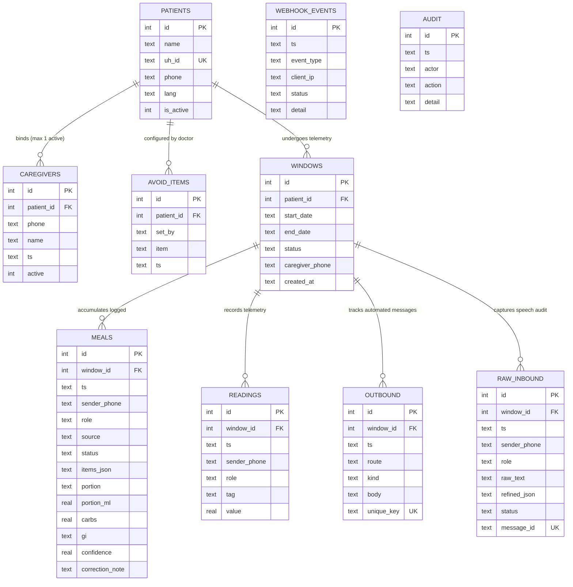
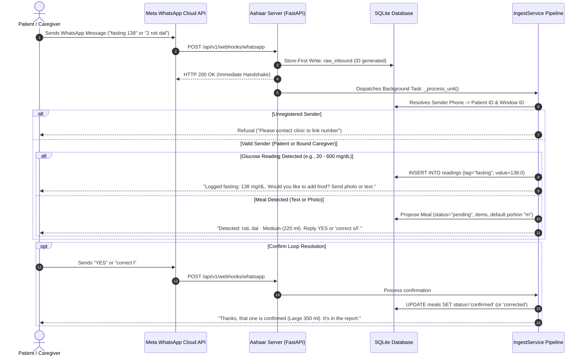
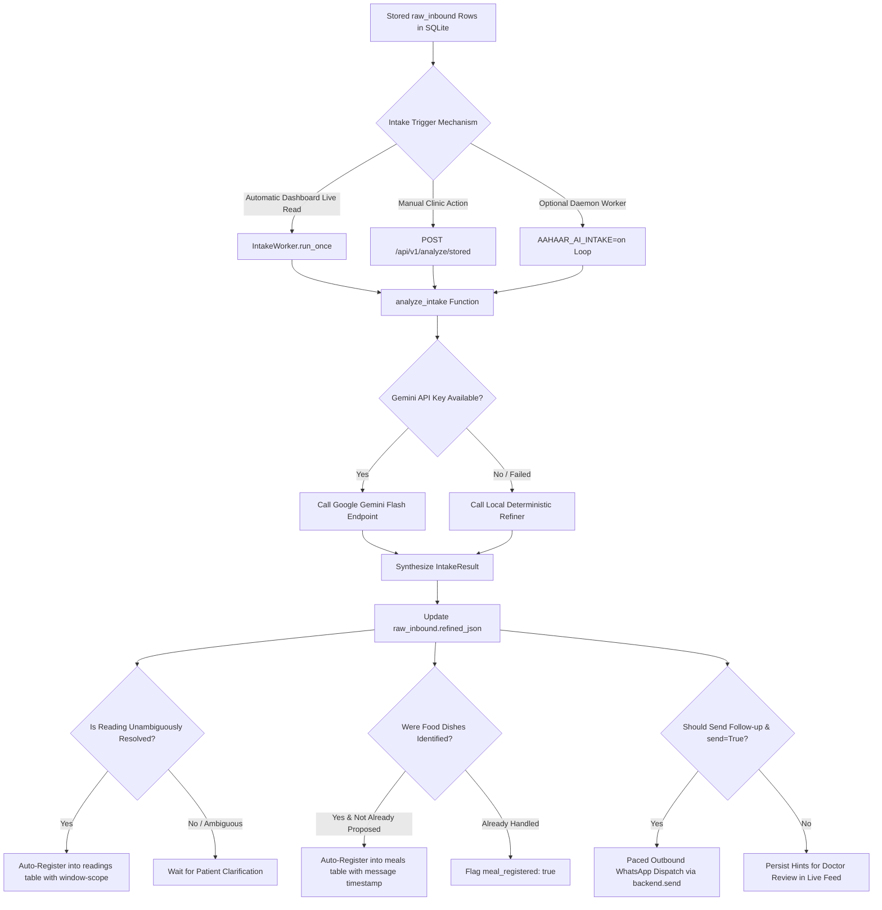
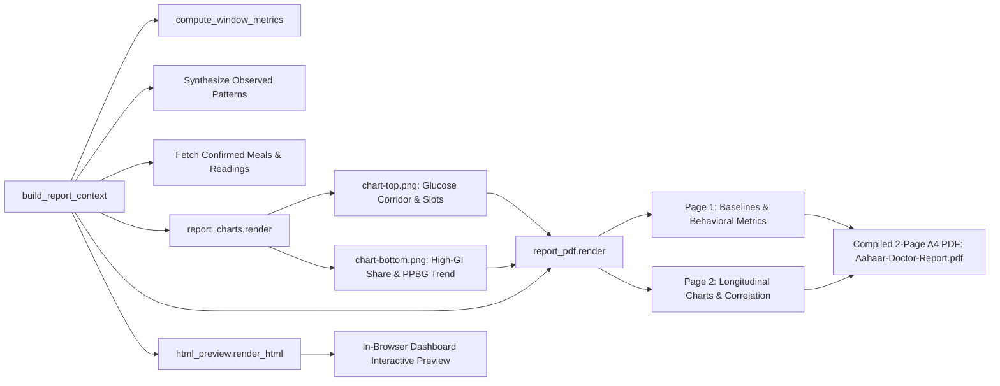

# Aahaar (आहार) — Clinical Telemetry & Glycemic Context Engine

> **Health-a-thon 2026 · Diabetes Care Track · Doctor & Care-Team Facing Platform**  
> **Anchor Use Case:** Consultation Readiness, Patient Telemetry Aggregation & Longitudinal Journey Review  
> **System Classification:** Assistive Decision-Support Telemetry Engine (Strictly Non-Diagnostic)

---

## Executive Summary & Engineering Vision

**Aahaar** is a specialized clinical telemetry and dietary context engine engineered for outpatient diabetes care departments (OPD). In contemporary diabetes consultations, clinicians are confronted with episodic, context-free glucometer prick logs and unreliable, retrospective dietary recall. 

Aahaar bridges this gap by transforming raw, multi-modal patient inputs—submitted asynchronously via **WhatsApp** (free-text meal descriptions, colloquial speech, food photos, glucometer readings)—into an objective, **two-page lab-grade "Glycemic Context" clinical report** and a **live clinician dashboard**.

```
                           +-------------------------------------------------------------+
                           |                     PATIENT / CAREGIVER                     |
                           |   WhatsApp: Free-text, Hinglish, Prick Numbers, Photos      |
                           +------------------------------+------------------------------+
                                                          |
                                      HTTPS (Meta WhatsApp Cloud API / Webhook)
                                                          |
                                                          v
+-------------------------------------------------------------------------------------------------------+
|                                        AAHAAR INGESTION & CORE                                        |
|                                                                                                       |
|  +---------------------------------+  Store-First   +----------------------------------------------+  |
|  |   Meta Webhook / Simulator      | -------------> | SQLite WAL Persistence Layer                 |  |
|  |   - GET /hub.challenge verify   |  (Immediate    | - raw_inbound (unaltered audit)              |  |
|  |   - POST inbound idempotency    |   Durability)  | - webhook_events (durable diagnostics)       |  |
|  +----------------+----------------+                +----------------------+-----------------------+  |
|                   |                                                        |                          |
|                   v                                                        |                          |
|  +---------------------------------+                                       |                          |
|  |      Role & Window Guards       |                                       |                          |
|  |  - Phone resolver (Patient+CG)  |                                       |                          |
|  |  - Active logging window check  |                                       |                          |
|  +----------------+----------------+                                       |                          |
|                   |                                                        |                          |
|                   v                                                        |                          |
|  +---------------------------------+                                       |                          |
|  |  Normalization & Ingress Parser |                                       |                          |
|  |  - Typo / Phonetic normalization|                                       |                          |
|  |  - Reading context extraction   |                                       |                          |
|  |  - Ambiguity detection (suppress|                                       |                          |
|  |    confirms for "230 or 330")   |                                       |                          |
|  +----------------+----------------+                                       |                          |
|                   |                                                        |                          |
|         +---------+---------+                                              |                          |
|         |                   |                                              |                          |
|         v                   v                                              |                          |
|  +-------------+     +-------------+                                       |                          |
|  | Glucometer  |     | Meal Plate  |                                       |                          |
|  | 20-600 mg/dL|     | Text/Vision |                                       |                          |
|  +------+------+     +------+------+                                       |                          |
|         |                   |                                              |                          |
|         |                   v                                              |                          |
|         |            +-------------+                                       |                          |
|         |            |Confirm Loop |                                       |                          |
|         |            |Propose Katori                                       |                          |
|         |            |Wait YES/corr|                                       |                          |
|         |            +------+------+                                       |                          |
|         |                   |                                              |                          |
|         v                   v                                              |                          |
|  +---------------------------------+                                       |                          |
|  |    Verified Clinical Database   | <-------------------------------------+                          |
|  |    (readings, confirmed meals)  |                                                                  |
|  +----------------+----------------+                                                                  |
+-------------------|-----------------------------------------------------------------------------------+
                    |
                    | Clean Telemetry Stream
                    v
+-------------------------------------------------------------------------------------------------------+
|                                    ANALYTICS & COMPUTATION ENGINE                                     |
|                                                                                                       |
|  - Time-in-Range (TIR: 70-180 mg/dL: in / above / below %)                                            |
|  - Meal Slot Segmentation: Post-Breakfast (PB), Post-Lunch (PL), Post-Dinner (PD)                      |
|  - Chronobiology: Weekday vs. Weekend Glycemic Deltas & High-GI Surges                                |
|  - Nutrition: High-GI Dietary Share (%), Carb Volatility Index (CVI)                                  |
|  - Statistical Modeling: Pearson Correlation (Daily High-GI Share vs. Postprandial Glucose)           |
+-------------------+---------------------------------------------------+-------------------------------+
                    |                                                   |
                    v                                                   v
+---------------------------------------+               +-----------------------------------------------+
|         REPORT RENDERING ENGINE       |               |          CLINICIAN WEB DASHBOARD              |
|                                       |               |                                               |
| - Matplotlib Agg Headless Charts      |               | - Real-Time Inbound Feed & Log Auditing       |
| - ReportLab 2-Page Lab-Style A4 PDF   |               | - Interactive Overview & Trend Visualizations |
| - Inline HTML/CSS Mirror Preview      |               | - Clinic Patient Phone Linking & Direct Chat  |
|                                       |               | - Diagnostic Testing & Meta WABA Setup        |
+---------------------------------------+               +-----------------------------------------------+
```

### Core Engineering Invariants
1. **Assistive, Non-Diagnostic Voice:** The engine organizes and contextualizes real self-reported patient telemetry. It never outputs a diagnostic label, disease classification, prognostic score, or pharmacological dosing directive. All clinical interpretation is left to the treating clinician.
2. **Information Asymmetry (Doctor-Patient Boundary):** The patient interface speaks strictly in colloquial terms and calibrated household volumetric units: **Small (150 ml)**, **Medium (220 ml)**, and **Large (350 ml)** *katoris*. Carbohydrate weights (grams), Glycemic Index categories (Low / Med / High), and Glycemic Volatility Indexes are **doctor-only metrics** restricted to clinical interfaces.
3. **The Confirm Loop:** Unverified estimates never pollute the clinical dataset. Meal plate proposals require explicit patient confirmation (`YES` or `correct l`) before transitioning to `confirmed` status. Only confirmed/corrected entries feed metrics and clinical reports.
4. **Strict Two-Number Role Guard:** Access to a patient's telemetry stream is guarded at the database level. Only the registered patient and a single designated active caregiver are authorized to submit logs. Unrecognized senders are rejected with guidance to register via clinic administration.
5. **Decoupled AI Architecture:** The live webhook pipeline operates deterministically with zero latency. Generative Large Language Models (Google Gemini) operate strictly as offline/asynchronous input-collection assistants over durable stored logs—never on the synchronous Meta webhook request path.

---

## Complete Project Directory Structure

```
health-a-thon-BioCypher--master/
├── LICENSE                          # Open source license (BSD-3-Clause)
├── README.md                        # Master architectural documentation & system analysis
├── pytest.ini                       # Pytest test execution configuration
├── requirements.txt                 # Runtime dependency specifications
├── .gitignore                       # Git exclusions (DBs, caches, reports, secrets)
│
├── app/                             # Core application package
│   ├── __init__.py                  # Package marker
│   ├── config.py                    # Immutable application configuration & environment switches
│   │
│   ├── core/                        # Headless pure-Python business logic & processing engine
│   │   ├── __init__.py              # Package marker
│   │   ├── ai.py                    # Multi-tier conversational AI & Gemini REST integration
│   │   ├── ai_worker.py             # Asynchronous background AI intake daemon worker
│   │   ├── datamodel.py             # SQLite WAL-mode schema, queries, and store-first persistence
│   │   ├── escalation.py            # Operational 9:00 PM caregiver-first missed-logging nudges
│   │   ├── intake_ai.py             # Intake collection assistant logic & missing-field analyzer
│   │   ├── metrics.py               # Statistical analytics: TIR, adherence, slots, CVI, Pearson r
│   │   ├── nutrition.py             # Indian food taxonomy (carbs, GI, katoris) & text classifier
│   │   ├── parse.py                 # Multi-modal input normalizer & ambiguity detector
│   │   ├── process.py               # Ingress pipeline, confirm loop, and role guard service
│   │   ├── report.py                # Descriptive clinical report context builder
│   │   └── seed.py                  # Deterministic demo and real-patient database seeding
│   │
│   ├── report/                      # Clinical report compilation and document graphics
│   │   ├── __init__.py              # Package marker
│   │   ├── charts.py                # High-resolution (270 DPI) Matplotlib dual-panel renderer
│   │   ├── html_preview.py          # Pure HTML/CSS in-browser mirror of the 2-page report
│   │   └── pdf.py                   # ReportLab Platypus 2-page publication-grade A4 PDF engine
│   │
│   ├── server/                      # HTTP layer & external communication interfaces
│   │   ├── __init__.py              # Package marker
│   │   ├── main.py                  # FastAPI application, route wiring, and webhook endpoints
│   │   └── whatsapp.py              # Channel abstraction: SimulatorBackend & Meta CloudBackend
│   │
│   └── static/                      # Zero-build single-page web dashboard
│       ├── app.js                   # Client-side controller, real-time polling, and UI state
│       ├── index.html               # Semantic HTML5 clinical dashboard
│       └── style.css                # Clinical typography, theme variables, and responsive layout
│
├── docs/                            # In-depth technical guides & integration walkthroughs
│   └── WHATSAPP_DEMO.md             # End-to-end Meta Cloud API & Cloudflare tunnel setup guide
│
├── scripts/                         # Automation CLI scripts & batch processing utilities
│   ├── analyze_stored.py            # Offline batch Gemini analysis over stored raw_inbound logs
│   ├── demo.py                      # 14-day end-to-end synthetic patient simulation & PDF build
│   └── seed_real.py                 # Seeder linking live demo to real WhatsApp phone numbers
│
└── tests/                           # Automated test suite (invariants, security, regression)
    ├── conftest.py                  # Isolated SQLite test fixtures & environment setups
    ├── test_linking.py              # Clinic phone linking, operator authorization, & Meta tests
    └── test_pipeline.py             # Safety invariants, confirm loop, TIR, & clinical boundaries
```

---

## Technology Stack Analysis

| Layer / Domain | Technology | Version Constraint | Engineering Rationale & Implementation Details |
| :--- | :--- | :--- | :--- |
| **Runtime Language** | **Python** | `>= 3.10` | Robust standard library, native `dataclasses`, strict type annotations, native `sqlite3`, thread safety. |
| **Web Framework** | **FastAPI** | `>= 0.115` | High-throughput asynchronous ASGI web server, automatic OpenAPI schema generation, integrated background tasks. |
| **ASGI Server** | **Uvicorn** | `>= 0.30` | Production-grade ASGI execution engine with uvloop and standard extras. |
| **Data Validation** | **Pydantic** | `>= 2.7` | High-performance type validation, settings management, and JSON serialization. |
| **Data Persistence** | **SQLite3 (Engine-Embedded)** | Native | Zero external database server overhead; single-file storage (`aahaar.db`). Enabled with **Write-Ahead Logging (`WAL`)** mode and 5000 ms busy timeout for concurrent read/write transactions. |
| **Mathematical Analytics** | **NumPy & Statistics** | Native / `>= 1.26` | Vectorized series transformations, handling of `NaN` glucose intervals, Pearson correlation coefficient ($r$), and population standard deviations. |
| **Data Visualization** | **Matplotlib** | `>= 3.8` | Configured with headless `Agg` backend. Renders publication-grade 270 DPI dual-panel charts with target corridors and weekend spans. |
| **Document Generation** | **ReportLab** | `>= 4.0` | Enterprise PDF document generation using Platypus flowables, custom TrueType font loading (`DejaVuSans`), and exact table geometric layout. |
| **PDF Inspection** | **PyMuPDF (fitz)** | `>= 1.24` | PDF rendering validation, page geometry checks, and text extraction testing. |
| **Image Processing** | **Pillow (PIL)** | Native / Compatible | Aspect ratio verification, DPI metadata inspection, and asset preparation for PDF flowables. |
| **HTTP Client** | **HTTPX** | `>= 0.27` | Synchronous and asynchronous HTTP client for Google Gemini REST API and Meta Graph API calls. |
| **AI / NLP Engine** | **Google Gemini API** | REST (`v1beta`) | Multimodal LLMs (`gemini-3.8-flash`, `gemini-3.5-flash`, `gemini-3.1-flash-lite`) utilized for conversational dialect translation and missing field extraction. |
| **Deterministic NLP** | **RegEx & Lexicons** | Native Python | Zero-latency local fuzzy refiner for Hinglish dialect normalization, Indian food token expansion, and glucometer string parsing. |
| **Messaging Channel** | **Meta WhatsApp Cloud API** | Graph API `v21.0` | Official WhatsApp Business Cloud API. Handles inbound webhooks, outbound interactive templates, and media downloading. |
| **Frontend UI** | **Vanilla JS / CSS3 / HTML5** | Zero-Build | Completely dependency-free frontend. No Node.js, Webpack, or npm runtime requirements. Uses native Fetch API, async/await, and CSS Grid/Flexbox. |
| **Testing Framework** | **Pytest** | `>= 8.0` | Fixture-based integration testing, environment isolation via `monkeypatch`, and Starlette `TestClient` endpoint verification. |

---

## Data Architecture & Persistence Model

The storage engine relies on a dependency-free SQLite schema engineered inside [`app/core/datamodel.py`](file:///Users/subhamdas/Documents/health-a-thon-BioCypher--master/app/core/datamodel.py).

### Entity-Relationship Diagram



### Key Schema Characteristics
1. **Store-First Raw Durability (`raw_inbound`):** Every inbound packet reaching the Meta webhook is inserted immediately before processing starts. An additive migration guarantees a `message_id` uniqueness check so redelivered Meta webhooks never execute downstream business logic twice.
2. **Durable Webhook Diagnostics (`webhook_events`):** Both `GET` verification handshakes and `POST` inbound payloads record their timestamp, client IP, delivery status, and raw JSON parameters in SQLite, ensuring diagnostic transparency across server restarts.
3. **Meal Life-Cycle Guard (`meals.status`):** Status transitions from `pending` &rarr; `confirmed` (or `corrected`). If an unconfirmed meal is superseded by a subsequent meal proposal, it is transitioned to `stale`. Metrics queries filter strictly on `status IN ('confirmed', 'corrected')`.
4. **Audit Immutability (`audit`):** Chronological ledger recording all clinical, administrative, and system events (e.g., patient phone linking, direct doctor messages, AI auto-registrations, and nudge executions).

---

## Comprehensive Workflow Analysis

### Workflow 1: Dual-Channel Ingestion & Verification Loop
Operates through [`app/core/process.py`](file:///Users/subhamdas/Documents/health-a-thon-BioCypher--master/app/core/process.py) and [`app/core/parse.py`](file:///Users/subhamdas/Documents/health-a-thon-BioCypher--master/app/core/parse.py).



#### Specialized Ambiguity Suppression Logic
If a patient sends an unresolved reading with alternative numbers (e.g., *"pata nahi shayad 230 or 330 i ate steak"*), [`ambiguous_reading_values()`](file:///Users/subhamdas/Documents/health-a-thon-BioCypher--master/app/core/parse.py#L175-L193) identifies candidate numbers. The webhook **suppresses** standard meal portion confirmation so the patient receives only **one** clarifying prompt regarding the blood sugar reading, preventing cognitive overload.

---

### Workflow 2: Decoupled AI Intake & Background Worker
Operates through [`app/core/intake_ai.py`](file:///Users/subhamdas/Documents/health-a-thon-BioCypher--master/app/core/intake_ai.py) and [`app/core/ai_worker.py`](file:///Users/subhamdas/Documents/health-a-thon-BioCypher--master/app/core/ai_worker.py).



---

### Workflow 3: Clinical Metrics & Longitudinal Telemetry Computation
Operates through [`app/core/metrics.py`](file:///Users/subhamdas/Documents/health-a-thon-BioCypher--master/app/core/metrics.py).

1. **Adherence Index ($AI$):**
   $$\text{Adherence Index} = \left( \frac{\text{Unique Calendar Days with } \ge 1 \text{ Confirmed Meal or Reading}}{\text{Elapsed Assessment Window Days}} \right) \times 100$$
2. **Time-in-Range (TIR):**
   Evaluates all logged readings across standard consensus thresholds:
   - **In Range:** $70.0 \le \text{Glucose} \le 180.0\text{ mg/dL}$
   - **Above Range:** $\text{Glucose} > 180.0\text{ mg/dL}$
   - **Below Range:** $\text{Glucose} < 70.0\text{ mg/dL}$
3. **Meal-Slot Chronobiology:**
   Every postprandial measurement is attributed to one of three chronological slots:
   - **Post-Breakfast (PB):** Tagged explicitly or matching preceding meal within 4 hours ($< 11:00\text{ AM}$).
   - **Post-Lunch (PL):** Tagged explicitly or matching preceding meal within 4 hours ($11:00\text{ AM} - 4:00\text{ PM}$).
   - **Post-Dinner (PD):** Tagged explicitly or matching preceding meal within 4 hours ($\ge 4:00\text{ PM}$).
   All slots are segmented into **Weekday (Mon–Fri)** versus **Weekend (Sat–Sun)** to isolate lifestyle variability.
4. **Carb Volatility Index (CVI):**
   Measures day-to-day dietary carbohydrate instability across the patient's assessment window:
   $$\text{CVI} = \frac{\sigma_{\text{daily\_carbs}}}{\mu_{\text{daily\_carbs}}}$$
5. **Pearson Correlation ($r$):**
   Determines the statistical relationship between daily high-GI meal share and observed postprandial glucose excursions:
   $$r = \frac{\sum (x - \bar{x})(y - \bar{y})}{\sqrt{\sum (x - \bar{x})^2 \sum (y - \bar{y})^2}}$$

---

### Workflow 4: Publication-Grade PDF Report Rendering
Operates through [`app/report/charts.py`](file:///Users/subhamdas/Documents/health-a-thon-BioCypher--master/app/report/charts.py) and [`app/report/pdf.py`](file:///Users/subhamdas/Documents/health-a-thon-BioCypher--master/app/report/pdf.py).



#### Page Layout Specifications
- **Page 1: Baselines & Behavioral Metrics:**
  - Header with Adherence Index KPI badge and patient demographic strip.
  - Section 1: Fasting (FPG) and Postprandial (PPBG) KPI cards, meal-slot breakdowns, TIR distribution bar, GI distribution bar, and calibrated katori portion table.
  - Section 2: Chronobiological weekday versus weekend comparison table, readings by context tag, and top staple genera table.
  - Section 3: Observed pattern cards highlighting specific clinical telemetry findings.
  - Footer: Prominent Assistive Decision-Support Notice.
- **Page 2: Visual Trend Analysis:**
  - Longitudinal Assessment header.
  - Upper Panel: High-resolution plot of blood glucose against the shaded target corridor ($70-180\text{ mg/dL}$) with distinct markers for PB, PL, PD, and FPG.
  - Lower Panel: High-GI dietary intake share bars superimposed over the continuous postprandial glucose moving line, with shaded weekend spans.
  - Metric Summary & Correlation Summary panels displaying calculated $r$ values and weekday-weekend delta points.

---

### Workflow 5: Operational Nudge Escalation Engine
Operates through [`app/core/escalation.py`](file:///Users/subhamdas/Documents/health-a-thon-BioCypher--master/app/core/escalation.py).

```
   Daily 21:00 Check (Cron / API POST /api/v1/nudges)
                         |
                         v
          Iterate Open Active Windows
                         |
                         v
   Have both a meal and reading been logged today?
       /                                  \
     YES                                   NO
      |                                     |
   Continue                                 v
                              Has unique key fired today?
                              ('esc-{window_id}-{date}')
                                  /                 \
                                YES                  NO
                                 |                    |
                              Continue                v
                                           Resolve Recipient:
                                           Caregiver Phone First
                                           (Fallback: Patient Phone)
                                                      |
                                                      v
                                           Dispatch Outbound Message &
                                           Record Idempotency Key in SQLite
```

---

## Detailed REST API Reference

All API routes are served by FastAPI in [`app/server/main.py`](file:///Users/subhamdas/Documents/health-a-thon-BioCypher--master/app/server/main.py).

| HTTP Method | Route Path | Authorization Header | Description & Functional Scope |
| :--- | :--- | :--- | :--- |
| `GET` | `/healthz` | None | System liveness probe; reports operational status and active channel backend. |
| `POST` | `/api/v1/inbound` | None | Neutral inbound message endpoint utilized by the test suite and simulator. |
| `GET` | `/api/v1/webhooks/whatsapp` | None (Hub verify) | Meta WhatsApp webhook challenge verification route (`hub.challenge`). |
| `POST` | `/api/v1/webhooks/whatsapp` | None (Payload-driven) | Meta WhatsApp Cloud API inbound webhook; store-first raw capture & background execution. |
| `GET` | `/api/v1/patients` | None | Lists all patient profiles, current window states, and linked contact numbers. |
| `POST` | `/api/v1/patients` | `X-Aahaar-Key` | Registers a new patient with initial 14-day window and optional caregiver. |
| `POST` | `/api/v1/patients/{pid}/linked` | `X-Aahaar-Key` | Links or updates patient and caregiver WhatsApp numbers for role guards. |
| `POST` | `/api/v1/patients/{pid}/message` | `X-Aahaar-Key` | Sends an instant, direct WhatsApp message from clinician to patient. |
| `GET` | `/api/v1/patients/{pid}/metrics` | None | Computes and returns comprehensive numerical metrics (TIR, slots, adherence). |
| `GET` | `/api/v1/patients/{pid}/report` | None | Assembles and returns the full JSON context dictionary for clinical report generation. |
| `POST` | `/api/v1/patients/{pid}/report/build`| None | Compiles the 2-page lab-style PDF and high-res chart PNGs. |
| `GET` | `/api/v1/patients/{pid}/report/preview`| None | Generates and returns responsive HTML/CSS mirror of the 2-page report. |
| `GET` | `/api/v1/patients/{pid}/report/charts`| None | Serves rendered PNG charts (`?which=top` or `?which=bottom`). |
| `GET` | `/api/v1/patients/{pid}/report/file` | None | Downloads the generated two-page PDF (`application/pdf`). |
| `GET` | `/api/v1/patients/{pid}/log` | None | Returns complete conversational ledger (`raw_inbound`, `outbound`, and `audit`). |
| `POST` | `/api/v1/patients/{pid}/clear-chat` | None | Wipes message thread for the specified patient while preserving clinical telemetry. |
| `GET` | `/api/v1/inbound/live` | None | Real-time live feed of all inbound messages across all senders with auto-analysis. |
| `GET` | `/api/v1/analyze/status` | None | Returns background AI intake worker status, polling frequency, and run history. |
| `POST` | `/api/v1/analyze/stored` | `X-Aahaar-Key` | Triggers on-demand Gemini AI intake analysis over stored messages with optional push. |
| `GET` | `/api/v1/debug/status` | None | Comprehensive diagnostic telemetry: token health, Gemini status, and dispatch codes. |
| `GET` | `/api/v1/debug/webhooks` | None | Detailed audit log of raw HTTP webhook callbacks received from Meta. |
| `POST` | `/api/v1/debug/test-whatsapp` | None | Diagnostic utility sending an immediate test ping to a verified WhatsApp phone. |
| `POST` | `/api/v1/debug/test-gemini` | None | Diagnostic utility testing connectivity and model responses from Google Gemini. |
| `POST` | `/api/v1/debug/meta/subscribe` | None | Automated Meta Graph API caller registering WABA webhooks. |
| `POST` | `/api/v1/nudges` | None | Triggers operational 9:00 PM missed-logging check for all active windows. |
| `POST` | `/api/v1/demo/seed` | None | Seeds or re-seeds demo patient database with default assessment window. |

---

## Configuration & Environment Variables

All settings are encapsulated within the immutable `Settings` dataclass in [`app/config.py`](file:///Users/subhamdas/Documents/health-a-thon-BioCypher--master/app/config.py):

| Variable Name | Default Value | Allowed Values | Functional Purpose |
| :--- | :--- | :--- | :--- |
| `AAHAAR_DB` | `aahaar.db` | File path | Target SQLite database file location. |
| `AAHAAR_WHATSAPP` | `simulator` | `simulator`, `cloud` | Channel plug-in selection. `simulator` prints to console/DB; `cloud` routes via Meta Graph API. |
| `AAHAAR_OP_KEY` | `aahaar-2026` | String | Security secret guarding clinic patient creation, number linking, and AI analysis triggers. |
| `AAHAAR_AI_ON_INBOUND` | `off` | `on`, `off`, `1`, `0` | Safety switch. When `off`, synchronous webhook uses deterministic parser; LLM runs only offline. |
| `AAHAAR_AI_INTAKE` | `off` | `on`, `off`, `1`, `0` | Controls whether the asynchronous background poller daemon (`IntakeWorker`) starts on boot. |
| `AAHAAR_AI_INTAKE_INTERVAL`| `15.0` | Seconds (Float) | Polling frequency for the decoupled AI intake background thread. |
| `AAHAAR_AI_INTAKE_AUTO_SEND`| `off` | `on`, `off`, `1`, `0` | Allows the intake background worker to auto-dispatch follow-ups via WhatsApp without clinician intervention. |
| `AAHAAR_AI_INTAKE_SEND_GAP`| `0.5` | Seconds (Float) | Rate-limiting pacing delay between consecutive outbound WhatsApp follow-ups. |
| `AAHAAR_AI_INTAKE_ON_READ` | `on` | `on`, `off`, `1`, `0` | Automatically runs intake analysis whenever the clinician dashboard queries `/api/v1/inbound/live`. |
| `AAHAAR_AI_INTAKE_ON_READ_SEND`| `on` | `on`, `off`, `1`, `0` | Pushes single paced WhatsApp intake follow-up when the dashboard reads live inbound messages. |
| `META_PHONE_ID` | `""` | Numeric String | Sender phone number identifier provided in the Meta Developer Portal. |
| `META_TOKEN` | `""` | System User Token | 24-hour or permanent Meta Graph API access token. |
| `META_VERIFY` | `aahaar-verify`| String | Webhook handshake token verified during Meta `GET` webhook registration. |
| `META_WABA_ID` | `""` | Numeric String | WhatsApp Business Account identifier for automatic webhook subscription. |
| `GEMINI_API_KEY` | `""` | Google AI Key | Google Gemini API key used for conversational reasoning and model discovery. |
| `AAHAAR_DEMO_PHONE` | `+917439030190` | International E.164| Default phone number assigned to demo patient during seeding. |
| `AAHAAR_DEMO_CAREGIVER` | `+917439030190` | International E.164| Default phone number assigned to demo caregiver during seeding. |

---

## Testing & Quality Assurance Architecture

The test suite in [`tests/test_pipeline.py`](file:///Users/subhamdas/Documents/health-a-thon-BioCypher--master/tests/test_pipeline.py) and [`tests/test_linking.py`](file:///Users/subhamdas/Documents/health-a-thon-BioCypher--master/tests/test_linking.py) verifies system invariants across 35+ automated tests:

```bash
python3 -m pytest tests -v
```

### Safety and Security Assertions
1. **Report Language Censors (`test_report_context_has_no_forbidden_language`):** Scans the entire generated report dictionary and asserts that clinical diagnostic or directive terms are strictly absent (`hyper`, `hypo`, `recom`, `should`, `advise`, `must`, `risk`, `predict`, `dose`, `prescrib`).
2. **Information Asymmetry Verification (`test_patient_replies_never_mention_carbs_or_gi`):** Ensures patient WhatsApp responses never mention raw nutritional calculations (`carbs`, `carb`, `glycemic index`, `gi`, `estimate is`).
3. **Role Enforcement (`test_unregistered_number_refused`):** Validates that messages from numbers not bound to the active window are denied entry and logged as unlinked.
4. **Caregiver Replacement Invariant (`test_two_number_rule`):** Enforces that assigning a new caregiver replaces the previous contact rather than creating unauthorized access points.
5. **Confirm Loop Integrity (`test_only_confirmed_meals_count`):** Proves that pending meals are excluded from clinical metrics until explicitly confirmed.
6. **Escalation Idempotency (`test_escalation_idempotent_and_daily_cap`):** Asserts that daily operational nudges fire at most once per calendar day per window.
7. **Store-First Idempotency (`test_webhook_store_first_duplicate_skip`):** Ensures re-transmitted Meta webhook payloads with duplicate message IDs are discarded.

---

## Operational Guide: Running the System

### 1. Environment Setup
```bash
# Clone and enter directory
cd /path/to/health-a-thon-BioCypher--master

# Create and activate virtual environment
python3 -m venv .venv
source .venv/bin/activate

# Install production dependencies
pip install -r requirements.txt
```

### 2. Execute 14-Day Simulation & Generate Report
```bash
# Simulates full 14-day cycle (~13 meals, 26 readings, confirm loops)
python3 -m scripts.demo --days 14

# Output PDF lands in:
# reports/Aahaar-Doctor-Report-1-<window-start>.pdf
```

### 3. Launch Clinician Dashboard & API Server
```bash
# Launch server pointing at generated demo database
AAHAAR_DB=aahaar-demo.db python3 -m uvicorn app.server.main:app --host 0.0.0.0 --port 8000

# Open browser to access dashboard:
# http://localhost:8000
```

### 4. Enable Real Meta WhatsApp Cloud Integration (Live OPD Mode)
Refer to the detailed guide in [`docs/WHATSAPP_DEMO.md`](file:///Users/subhamdas/Documents/health-a-thon-BioCypher--master/docs/WHATSAPP_DEMO.md):
```bash
# Terminal 1: Launch server with Meta Cloud credentials
AAHAAR_WHATSAPP=cloud \
AAHAAR_DB=aahaar-demo.db \
META_PHONE_ID="<your-meta-phone-id>" \
META_TOKEN="<your-meta-access-token>" \
META_VERIFY="aahaar-verify" \
GEMINI_API_KEY="<your-gemini-key>" \
python3 -m uvicorn app.server.main:app --host 0.0.0.0 --port 8000

# Terminal 2: Expose public HTTPS tunnel
cloudflared tunnel --url http://localhost:8000
```
- In the **Meta Developer Portal &rarr; WhatsApp &rarr; Configuration &rarr; Webhook**:
  - Set Callback URL to: `https://<your-tunnel>.trycloudflare.com/api/v1/webhooks/whatsapp`
  - Set Verify Token to: `aahaar-verify`
  - Subscribe to the **`messages`** webhook field.
- In the **Clinician Dashboard &rarr; Live tab**:
  - Click **Subscribe Meta Webhooks** to auto-link your WABA account.
  - Test connectivity using **Test WhatsApp Ping**.