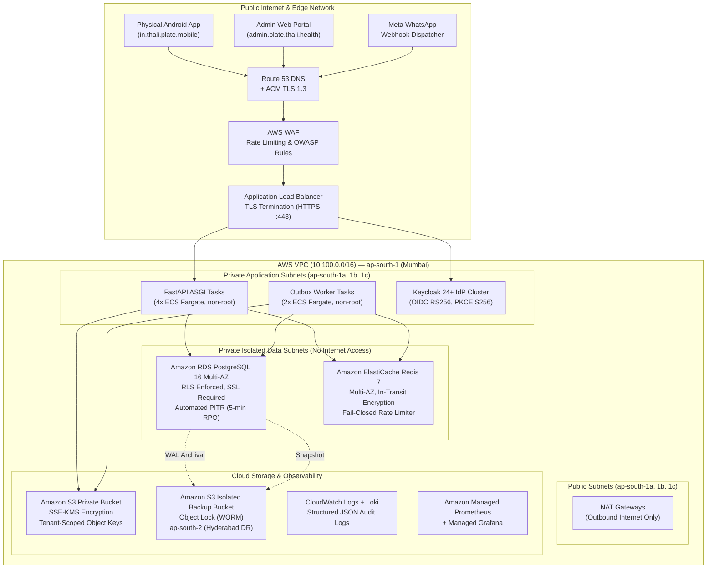

# THALI + P.L.A.T.E. Production Topology & Cloud Architecture Specification

**System:** THALI + P.L.A.T.E. Assistive Diabetes-Care Platform  
**Target Environment:** Production (`THALI_APP__ENV=production`)  
**Deployment Region:** India (`ap-south-1` Mumbai)  
**Regulatory Compliance:** India Digital Personal Data Protection (DPDP) Act 2023, MoHFW Electronic Health Record (EHR) Standards 2016  

---

## 1. Cloud Topology Overview



---

## 2. Infrastructure Inventory & Topology Specifications

| Component | Technology | Target Provider / Spec | Region / AZs | Network Isolation |
| :--- | :--- | :--- | :--- | :--- |
| **Cloud Provider** | AWS (Amazon Web Services) | Enterprise Dedicated VPC | `ap-south-1` (Mumbai) | Isolated 10.100.0.0/16 CIDR |
| **Primary Region** | `ap-south-1` | 3 Availability Zones | `1a`, `1b`, `1c` | High availability across 3 data centers |
| **Secondary Region (DR)** | `ap-south-2` | Hyderabad Disaster Recovery | `2a`, `2b` | Asynchronous cross-region backup vault |
| **DNS** | Amazon Route 53 | Latency-based + Health Checks | Global Anycast | Strict DNSSEC enabled |
| **TLS / Ingress** | AWS ALB + ACM | TLS 1.3 / TLS 1.2 minimum | Edge / Public subnets | HSTS, CSP, X-Content-Type-Options |
| **WAF** | AWS WAF | Managed Rules + Rate Limiting | Edge | Protects against SQLi, XSS, bots |
| **Identity Provider** | Keycloak 24+ | ECS Fargate Cluster | Private App Subnet | RS256 JWKS, S256 PKCE, HTTPS only |
| **API Service** | FastAPI (Python 3.12) | ECS Fargate (4x tasks) | Private App Subnet | Non-root `thali:thali` (UID 10001) |
| **Worker Service** | Transactional Outbox | ECS Fargate (2x tasks) | Private App Subnet | Short-lived sessions, leased polling |
| **Database** | PostgreSQL 16.2 | Amazon RDS Multi-AZ | Private Data Subnet | Strict RLS, SSL `verify-full`, UTC |
| **Cache & Limiting** | Redis 7.2 | Amazon ElastiCache Multi-AZ | Private Data Subnet | Auth token, in-transit encryption, volatile-lru |
| **Object Storage** | Amazon S3 | Private Bucket (`s3://thali-...`) | `ap-south-1` | SSE-KMS, Block All Public Access |
| **Audit Logs** | Grafana Loki + CloudWatch | WORM Compliant Retention | `ap-south-1` | 365-day immutable audit trail |
| **Metrics & Alerts** | Prometheus + Alertmanager | Amazon Managed Prometheus | `ap-south-1` | 13 automated alert runbooks |
| **Tracing** | OpenTelemetry + Tempo | AWS OTel Collector | `ap-south-1` | End-to-end W3C trace propagation |

---

## 3. Secret Management Architecture

Production credentials must never be committed into source control, Dockerfiles, client artifacts, or CI logs.

### Production Secret Hierarchy:
1. **Secret Store:** AWS Secrets Manager with KMS Customer Managed Key (CMK) and automatic 90-day rotation for database and administrative credentials.
2. **Container Injection:** ECS task definitions retrieve secrets directly from AWS Secrets Manager using IAM task execution roles at task boot time.
3. **Fail-Closed Application Startup:** `validate_security_configuration(settings)` validates that all mandatory secrets are present, possess at least 32 characters of entropy (or 16 for Redis/internal tokens), and do not match any development placeholders. Startup halts immediately (`sys.exit(1)`) on any defect.

---

## 4. Keycloak Production Realm & RBAC Configuration

- **Realm Name:** `thali-production`
- **Issuer URL:** `https://auth.plate.thali.health/realms/thali-production`
- **Audience:** `thali-backend-api`
- **Algorithms Allowed:** `RS256` only (all symmetric algorithms like `HS256` unconditionally rejected)
- **PKCE:** Enforced with `S256` for all public clients (`thali-admin-web` and `thali-mobile-app`).
- **Session Policies:**
  - Access Token Lifespan: 5 minutes (300 seconds)
  - Refresh Token Lifespan: 8 hours (28,800 seconds) with one-time rotation
  - SSO Session Idle: 30 minutes (1,800 seconds)
  - SSO Session Max: 12 hours (43,200 seconds)
- **Role Inventory (8 Distinct Roles):**
  1. `Patient`
  2. `Caregiver`
  3. `Doctor`
  4. `Nurse`
  5. `Care Coordinator`
  6. `Dietitian/Diabetes Educator`
  7. `Field Health Worker`
  8. `Admin` (Strictly zero access to clinical PHI)

---

## 5. Production Database & Row Level Security (RLS)

- **Engine:** PostgreSQL 16.2 on Amazon RDS with Multi-AZ automated failover.
- **Connection Security:** Mandatory SSL (`sslmode=verify-full`), non-superuser runtime role `thali_app_user` with `NOSUPERUSER NOBYPASSRLS`.
- **Pool Sizing:**
  - `pool_size`: 10 connections per API container
  - `max_overflow`: 20 connections
  - `pool_timeout`: 5.0 seconds (fail-closed bounded wait)
  - `pool_recycle`: 1800 seconds
  - `pool_pre_ping`: `true` (validates connection liveness before checkout)
  - `pool_reset_on_return`: `rollback` (erases all transaction-local state)
- **RLS Invariant:**
  Every SQL query executed by the application operates under:
  ```sql
  SELECT set_config('app.current_tenant_id', :tenant_id, true);
  ```
  PostgreSQL RLS policies unconditionally filter all read, insert, update, and delete actions by `tenant_id`. Unauthenticated or unset tenant queries return 0 rows.
