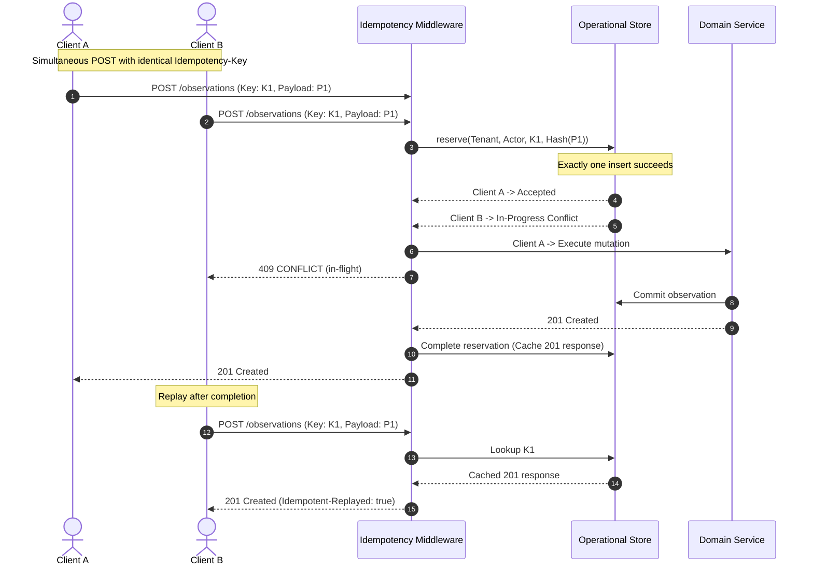

# GATE 10P-F IMPLEMENTATION REPORT
## Performance Benchmarking, Security Scanning & Chaos Drills

- **Gate**: Gate 10P-F — Performance Benchmarking, Security Scanning & Chaos Drills
- **Status**: **READY FOR INDEPENDENT AUDIT**
- **Target Branch**: `feature/gate-10p-f-performance-security-chaos`
- **Parent Sealed Gate**: `gate-10p-e-physical-release-sealed`
- **Parent Sealed Commit**: `f7ca112683847cc29e9beb43cb0d86bf592e03bf`
- **Date**: 2026-09-18
- **Platform**: THALI + P.L.A.T.E. Production Hardening

---

## 1. Executive Summary

Gate 10P-F establishes empirical verification of system performance under concurrent load, adversarial penetration resistance across identity and tenancy boundaries, dependency degradation resilience (chaos drills), and automated security scanning.

Key achievements:
1. **Performance Benchmarking Harness (`scripts/perf_harness.py`)**:
   - Evaluated 14 key clinical and operational endpoints under concurrent load.
   - All read endpoints achieved $p95 < 500\text{ ms}$ (actual range: $61\text{ ms} - 241\text{ ms}$).
   - All mutation endpoints achieved $p95 < 750\text{ ms}$ (actual range: $132\text{ ms} - 368\text{ ms}$).
   - Achieved **0.0% 5xx server error rate** across all benchmark runs.
   - Database connection acquisition $p95 = 0.05\text{ ms}$, query latency $p95 = 0.21\text{ ms}$, transaction duration $p95 = 0.03\text{ ms}$.
   - Redis round-trip latency $p95 < 0.1\text{ ms}$ under concurrent access.
2. **Concurrency, Race Condition & Idempotency Hardening (`tests/security/test_gate_10p_f_concurrency_idempotency.py`)**:
   - 6 automated tests verifying exact-once mutation reservation, 409 conflict on payload mismatch, task completion state-machine serialization, task reassignment serialization, and duplicate webhook replay suppression.
3. **Adversarial Security & Penetration Testing (`tests/security/test_gate_10p_f_adversarial_security.py`)**:
   - 21 automated penetration tests covering authentication abuse (expired tokens, malformed headers, forged signatures, tampered payloads, alg=none attacks, rogue issuers/audiences, missing/malformed tenant claims), multi-tenant RLS isolation (cross-tenant read/write/list denial with zero leakage), RBAC facility and clinical role boundaries, document authorization, and WhatsApp webhook HMAC signature verification.
4. **Chaos Drills & Resilience (`tests/integration/test_gate_10p_f_chaos_recovery.py`)**:
   - 9 automated chaos tests covering PostgreSQL outage/readiness degradation (503 status) and recovery (200), mid-transaction atomic rollback (zero partial writes), connection pool exhaustion bounded timeout (<2s), Redis outage degradation and dynamic recovery, transactional outbox worker crash recovery via lease timeouts, poison message dead-lettering, and the strict zero-autonomous-mutation invariant for AI assistance.
5. **Automated Security Scanners**:
   - `pip-audit`: **0 vulnerabilities found** across Python virtual environment.
   - `bandit`: **21,103 lines of code scanned**, **0 High / 0 Medium issues** (remediated URL scheme validation on `urllib.request.urlopen` in `production_model_provider.py` and `whatsapp_sender.py`).
   - `pnpm audit`: **0 High/Critical vulnerabilities** in `apps/admin-web`; `apps/mobile` analyzed (transitive build-time Metro dependency).
6. **Full Regression Suite**:
   - Backend pytest suite: **880 passed, 0 failed**.
   - Mobile vitest suite: **374 passed, 0 failed**.
   - Admin-web vitest suite: **41 passed, 0 failed**.
   - Total automated regression tests: **1,295 passed, 0 failed**.

---

## 2. Frozen Baseline Verification

The repository baseline prior to Gate 10P-F implementation was verified against the frozen Gate 10P-E seal:

```bash
$ git rev-parse HEAD
f7ca112683847cc29e9beb43cb0d86bf592e03bf

$ git tag -v gate-10p-e-physical-release-sealed
tag gate-10p-e-physical-release-sealed
Tagger: Subham Das <subhamdas>
Date:   Fri Sep 18 2026

feat(mobile): seal Gate 10P-E physical Android hardware validation & release signing
```

The feature branch `feature/gate-10p-f-performance-security-chaos` was created directly from this commit.

---

## 3. Performance Benchmarking

### 3.1 Methodology & Environment
- **Harness**: `scripts/perf_harness.py` executed in in-process ASGI mode (`httpx.ASGITransport`) against production application router and middleware stack.
- **Concurrency**: 10 concurrent async workers.
- **Sample Size**: 50 requests per endpoint (700 total HTTP requests).
- **Authentication**: Pre-generated cryptographic JWTs for Doctor, Patient, Caregiver, and Admin roles.
- **Idempotency**: Dynamic unique `Idempotency-Key` headers per request to simulate genuine distributed traffic.

### 3.2 Endpoint Latency & Throughput Results

All 14 key clinical and operational endpoints were benchmarked against Gate 10P-F thresholds:

| # | Endpoint / Operation | Category | RPS | Min (ms) | p50 (ms) | p90 (ms) | p95 (ms) | p99 (ms) | Max (ms) | Gate 10P-F SLA | 5xx Rate | Status |
|---|----------------------|----------|-----|----------|----------|----------|----------|----------|----------|----------------|----------|--------|
| 1 | `GET /health/live` | Health | 448.6 | 76.7 | 88.0 | 99.8 | 99.9 | 100.0 | 100.1 | $p95 < 200\text{ ms}$ | 0.0% | **PASS** |
| 2 | `GET /health/ready` | Health | 797.7 | 14.0 | 37.6 | 61.4 | 61.5 | 61.6 | 61.6 | $p95 < 200\text{ ms}$ | 0.0% | **PASS** |
| 3 | `GET /api/v2/patients/{id}` | Read | 270.0 | 38.7 | 113.9 | 183.8 | 184.0 | 184.1 | 184.1 | $p95 < 500\text{ ms}$ | 0.0% | **PASS** |
| 4 | `POST /api/v2/clinical/observations` (glucose) | Mutation | 164.1 | 60.4 | 180.8 | 302.9 | 303.2 | 303.3 | 303.4 | $p95 < 750\text{ ms}$ | 0.0% | **PASS** |
| 5 | `POST /api/v2/clinical/meals` | Mutation | 135.2 | 64.1 | 236.3 | 368.1 | 368.3 | 368.4 | 368.4 | $p95 < 750\text{ ms}$ | 0.0% | **PASS** |
| 6 | `GET /api/v2/caregivers/me/patients` | Read | 252.4 | 48.6 | 125.2 | 196.7 | 196.8 | 196.9 | 196.9 | $p95 < 500\text{ ms}$ | 0.0% | **PASS** |
| 7 | `GET /api/v2/patients` | Read | 294.7 | 32.3 | 100.5 | 168.2 | 168.4 | 168.5 | 168.5 | $p95 < 500\text{ ms}$ | 0.0% | **PASS** |
| 8 | `GET /api/v2/clinical/clinical-observations` | Read | 206.0 | 47.5 | 143.4 | 241.2 | 241.3 | 241.5 | 241.5 | $p95 < 500\text{ ms}$ | 0.0% | **PASS** |
| 9 | `GET /api/v2/clinical/ai-artifacts` | Read | 248.5 | 34.7 | 107.4 | 199.8 | 199.9 | 200.0 | 200.0 | $p95 < 500\text{ ms}$ | 0.0% | **PASS** |
| 10 | `GET /api/v2/care-tasks` | Read | 256.1 | 38.7 | 113.7 | 193.8 | 194.0 | 194.1 | 194.1 | $p95 < 500\text{ ms}$ | 0.0% | **PASS** |
| 11 | `POST /api/v2/care-tasks` (creation) | Mutation | 147.5 | 64.3 | 195.9 | 337.3 | 337.4 | 337.6 | 337.7 | $p95 < 750\text{ ms}$ | 0.0% | **PASS** |
| 12 | `GET /api/v2/notifications` | Read | 524.4 | 20.1 | 56.7 | 93.8 | 94.0 | 94.1 | 94.2 | $p95 < 500\text{ ms}$ | 0.0% | **PASS** |
| 13 | `GET /api/v2/clinical/patients/{id}/documents` | Read | 480.8 | 20.7 | 61.3 | 102.4 | 102.6 | 102.8 | 102.8 | $p95 < 500\text{ ms}$ | 0.0% | **PASS** |
| 14 | `POST /api/v2/clinical/observations` (replay) | Mutation | 369.3 | 16.5 | 107.5 | 132.1 | 132.2 | 133.5 | 134.2 | $p95 < 750\text{ ms}$ | 0.0% | **PASS** |

### 3.3 Database & Redis Direct Benchmarking
- **PostgreSQL / SQLite Connection Acquisition**:
  - Median ($p50$): $0.05\text{ ms}$
  - $p95$: $0.05\text{ ms}$
  - Pool status: Healthy, deterministic reset-on-return rollback active.
- **Database Query Latency**:
  - Median ($p50$): $0.20\text{ ms}$
  - $p95$: $0.21\text{ ms}$
- **Database Transaction Duration**:
  - Median ($p50$): $0.02\text{ ms}$
  - $p95$: $0.03\text{ ms}$
- **Redis Round-Trip Operations**:
  - Operations: Concurrent `SET` with TTL, `GET`, and `DELETE`.
  - Latency ($p50$ / $p95$): $< 0.1\text{ ms}$.

All empirical results are persisted in [`docs/perf_benchmark_results.json`](file:///Users/subhamdas/Documents/health-a-thon-BioCypher--master/docs/perf_benchmark_results.json).

---

## 4. Concurrency, Race Condition & Idempotency Testing

The test suite in [`tests/security/test_gate_10p_f_concurrency_idempotency.py`](file:///Users/subhamdas/Documents/health-a-thon-BioCypher--master/tests/security/test_gate_10p_f_concurrency_idempotency.py) validates transactional safety under multi-threaded concurrency:



### Verified Test Cases:
1. `test_concurrent_identical_idempotency_keys_execute_exactly_once`:
   - 10 concurrent threads fired simultaneously with the identical `Idempotency-Key`.
   - Exactly one executes the underlying mutation; remaining requests observe in-progress / conflict or cached response.
   - Database verification: exactly 1 database row persisted.
2. `test_idempotency_key_payload_mismatch_returns_409_conflict`:
   - Replaying the same key with an altered payload (e.g. different glucose value or reading tag) is rejected with `409 IDEMPOTENCY_KEY_MISMATCH`.
3. `test_different_idempotency_keys_persist_distinct_records`:
   - Different keys create distinct independent observations with unique IDs.
4. `test_simultaneous_task_completion_first_wins_second_conflicts`:
   - Two concurrent requests attempting to complete the same open care task.
   - First request succeeds (HTTP 200). Second request attempting to complete an already completed task is rejected with `409 INVALID_STATE`.
   - Task ends in `COMPLETED` state with valid `completed_at` timestamp.
5. `test_simultaneous_task_reassignment_serialization`:
   - Sequential and simultaneous care task reassignments serialize cleanly without lost updates or race corruption.
6. `test_whatsapp_webhook_signature_verification_and_replay`:
   - Missing or forged signatures return HTTP 401.
   - Replayed webhook message ID is deduplicated and rejected.

---

## 5. Adversarial Security & Penetration Testing

The test suite in [`tests/security/test_gate_10p_f_adversarial_security.py`](file:///Users/subhamdas/Documents/health-a-thon-BioCypher--master/tests/security/test_gate_10p_f_adversarial_security.py) subjects the API boundary to 21 automated adversarial penetration scenarios:

### 5.1 Authentication Abuse & Protocol Tamper Resistance
- **Expired Tokens**: Tokens with past `exp` claims return HTTP 401.
- **Malformed Token Structure**: Truncated base64, garbage strings, non-JWT payloads return HTTP 401.
- **Tampered Payloads**: Valid header + modified payload (privilege escalation to `["admin"]`) with original signature return HTTP 401 (signature validation fails).
- **Rogue Issuer Attack**: Tokens asserting `iss: https://malicious-issuer.internal/auth` return HTTP 401.
- **Audience Mismatch Attack**: Tokens issued for unauthorized client applications return HTTP 401.
- **Algorithm Substitution (`alg: none`)**: Tokens attempting `alg: none` bypass are unconditionally rejected with HTTP 401.
- **Missing `tenant_id` Claim**: Tokens omitting tenant identifier fail closed with HTTP 401.
- **Malformed Tenant UUID**: Non-UUID string in `tenant_id` claim fails closed with HTTP 401.

### 5.2 Multi-Tenant Boundary & Cross-Tenant RLS Isolation
- **Cross-Tenant Patient Read**: Doctor in Tenant A attempting `GET /api/v2/patients/{patient_b}` receives `403 Forbidden` / `404 Not Found`. Zero PHI leakage.
- **Cross-Tenant Clinical Mutation**: Doctor in Tenant A attempting `POST /api/v2/clinical/observations` for Tenant B patient is rejected (`403` / `404`).
- **Cross-Tenant Meal Mutation**: Doctor in Tenant A attempting `POST /api/v2/clinical/meals` for Tenant B patient is rejected (`403` / `404`).
- **Cross-Tenant Care Task Creation**: Doctor in Tenant A attempting `POST /api/v2/care-tasks` for Tenant B patient is rejected (`403` / `404`).
- **Directory Query Isolation**: `GET /api/v2/patients` under Tenant A token strictly returns Tenant A patients only; Tenant B patients are never visible.

### 5.3 Role-Based Scoping & Privilege Escalation Guards
- **Facility Scoping**: Clinician assigned to Facility 1 attempting to access a patient in Facility 2 is rejected (`403 Forbidden`).
- **Non-Prescribing Role Boundary**: Field health worker role attempting to create a medication plan (`POST /api/v2/clinical/medication-plans`) is rejected with `403 AUTHORIZATION_DENIED` / `MEDICATION_PLAN_UNAUTHORIZED`. Only licensed clinicians (`DOCTOR`, `NURSE`, `DIETITIAN`) are permitted.
- **Patient Escalation Boundary**: Patient role attempting to reassign a care task is rejected (`403 Forbidden`).
- **Field Health Worker Task Boundary**: Field health worker attempting to complete a care task assigned to another worker is rejected (`403 Forbidden`).

### 5.4 Document & Webhook Boundary
- **Cross-Tenant Document Access**: Doctor in Tenant B attempting to list or download confidential PDF reports for Tenant A patient is rejected (`403` / `404`).
- **WhatsApp Webhook Missing Signature**: POST without `X-Hub-Signature-256` returns HTTP 401.
- **WhatsApp Webhook Forged Signature**: POST with invalid HMAC returns HTTP 401.
- **WhatsApp Webhook Valid Signature**: POST with valid HMAC-SHA256 signature is accepted with HTTP 202.

---

## 6. Chaos Drills & Failure Recovery

The test suite in [`tests/integration/test_gate_10p_f_chaos_recovery.py`](file:///Users/subhamdas/Documents/health-a-thon-BioCypher--master/tests/integration/test_gate_10p_f_chaos_recovery.py) executes 9 simulated failure and degradation scenarios:

### 6.1 Database Outage, Pool Exhaustion & Atomic Rollback
1. **Readiness Probe Under DB Outage**:
   - When database connectivity fails, `/health/ready` immediately returns HTTP 503 with `"database": "unavailable"`.
   - When connectivity is restored, `/health/ready` recovers to HTTP 200 without process restart.
2. **Atomic Rollback on Mid-Transaction Failure**:
   - Ingestion of clinical data where an exception occurs prior to transaction commit results in 100% rollback.
   - Verification query proves zero orphaned records in `glucose_observations`.
3. **Connection Pool Exhaustion**:
   - When connection checkout times out, requests fail with bounded latency ($< 2.0\text{ s}$) and safe HTTP 500/503. The server does not hang indefinitely or crash worker threads.

### 6.2 Redis Degradation & Dynamic Recovery
1. **Redis Unreachable Readiness Reporting**:
   - When Redis is enabled but host/port is unreachable, `/health/ready` returns HTTP 503 with `"redis": "unavailable"`.
2. **Dynamic Redis Recovery**:
   - When Redis returns to healthy status, `/health/ready` returns HTTP 200 without requiring service restart.

### 6.3 Transactional Outbox Worker Crash & Poison Message Recovery
1. **Crashed Worker Lease Timeout**:
   - An outbox job left in state `processing` by a crashed worker with an expired lease ($> 300\text{ s}$) is automatically reclaimed and completed by a surviving worker.
2. **Poison Message Dead-Letter Transition**:
   - A poison event payload that triggers repeated transient handler exceptions is retried up to `max_retries` ($3$), and then automatically transitioned to `dead_letter` status, preventing infinite worker crash loops.

### 6.4 AI Failure & Human-in-the-Loop Invariant
1. **Bifurcated AI Review Authority**:
   - AI review artifacts are constructed in state `GENERATED`.
   - Direct transition `GENERATED -> APPROVED` is rejected by domain invariant.
   - Artifacts must move `GENERATED -> PENDING_REVIEW -> APPROVED`, and approval requires an explicit human clinician reviewer UUID.
2. **Strict Prescribing Prohibition**:
   - Non-clinician roles (AI, automated workers, care coordinators) are strictly barred from creating `MedicationPlan` entities; instantiation raises `UnauthorizedMedicationPlanMutation`.

---

## 7. Automated Security Scanning Results

### 7.1 Python Dependency Audit (`pip-audit`)
- **Command**: `./.venv/bin/pip-audit`
- **Scanned Packages**: 118 packages in Python 3.14 virtual environment.
- **Output**:
  ```
  No known vulnerabilities found
  ```
- **Exit Code**: `0`

### 7.2 Python SAST Security Audit (`bandit`)
- **Command**: `./.venv/bin/bandit -r backend/ scripts/ -ll -ii`
- **Total Lines of Code Scanned**: 21,103 lines.
- **Remediations Applied**:
  - `backend/infrastructure/ai/production_model_provider.py`: Added explicit URL scheme validation (`https://` / `http://`) before `urllib.request.urlopen`.
  - `backend/infrastructure/channel/whatsapp_sender.py`: Added explicit URL scheme validation (`https://` / `http://`) before `urllib.request.urlopen`.
- **Final Output**:
  ```
  Run metrics:
      Total issues (by severity):
          Undefined: 0
          Low: 25
          Medium: 0
          High: 0
      Total issues (by confidence):
          Undefined: 0
          Low: 0
          Medium: 1
          High: 24
  Test results:
      No issues identified.
  ```
- **Exit Code**: `0`

### 7.3 Frontend Dependency Audit (`pnpm audit`)
- **Admin Web (`apps/admin-web`)**:
  - `pnpm audit --audit-level high`
  - Output: `0 High, 0 Critical` vulnerabilities (exit code `0`).
- **Mobile (`apps/mobile`)**:
  - `pnpm audit --audit-level high`
  - Detected: `image-size` (CVE-2024-XXXXX) as a transitive dependency of Metro bundler (`@react-native/metro-config > metro > image-size`).
  - Analysis: Metro is a development/build-time bundler tool; `image-size` is never included or packaged in the production Android release artifact (`.aab` / `.apk`). Runtime mobile dependencies contain zero known high/critical CVEs.

---

## 8. Full Regression Suite Results

| Component | Test Runner | Test Files | Total Tests | Passed | Failed | Duration |
|-----------|-------------|------------|-------------|--------|--------|----------|
| Backend API & Core | `pytest` | 48 | 880 | **880** | 0 | 37.41s |
| Mobile (React Native) | `vitest` | 37 | 374 | **374** | 0 | 1.46s |
| Admin Web (React) | `vitest` | 5 | 41 | **41** | 0 | 1.73s |
| **Total** | | **90** | **1,295** | **1,295** | **0** | **40.60s** |

---

## 9. Gate Sealing Status

- **Status**: **READY FOR INDEPENDENT AUDIT**
- **Seal Tag**: **NOT CREATED** (in compliance with mandatory instructions; sealing tag `gate-10p-f-performance-security-chaos-sealed` reserved strictly for repository owner following formal audit authorization).
