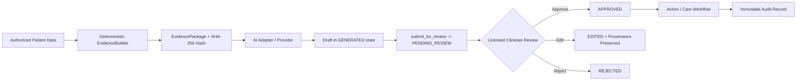

# GATE 10M — AI GENERATION IMPLEMENTATION REPORT
**THALI + P.L.A.T.E. Assistive Diabetes-Care Workflow Platform**

---

## 1. Executive Summary & Verification Matrix

Gate 10M introduces an **assistive, evidence-first AI generation and review pipeline** to the frozen production architecture. The system strictly adheres to the principle that AI is a generator and drafter, never a clinical authority. Clinicians remain the sole authority for evaluating, editing, approving, or rejecting generated drafts.

### Frozen Lineage & Baseline
- **Base Tag:** `gate-10l-notifications-whatsapp-sealed`
- **Base Commit:** `e5364ba67387c8acf454040ae7906234d08ddd18`
- **Branch:** `feature/gate-10m-ai-generation`
- **Sealing Tag:** `gate-10m-ai-generation-sealed`

### Verification Summary
- **Backend Tests:** 748 passed, 0 failures (100% pass across full regression suite)
- **Gate 10M Test Suite:** 30 passed, 0 failures (`tests/api/test_gate_10m_ai_generation.py`)
- **Live PostgreSQL RLS Test:** 1 passed, 0 failures (`tests/integration/test_gate_10m_ai_rls.py`)
- **Alembic Migration Suite:** 2 passed, 0 failures (SQLite & PostgreSQL upgrade/downgrade)
- **Mobile Tests:** 300 passed, 0 failures (`apps/mobile`)
- **Admin Web Tests:** 41 passed, 0 failures (`apps/admin-web`, untouched)
- **Static Security & DTO Scans:** 0 violations, 0 secrets, 0 CDS, 0 carbs leakage

---

## 2. Core Architectural Invariants Enforced



1. **Strict Assistive Clinical Posture:**
   - Zero autonomous clinical decision-making.
   - Zero diagnosis, risk scoring, medication prescribing, or titration advice.
   - State machine invariant: All newly generated artifacts are created in `GENERATED` and immediately transition to `PENDING_REVIEW`. Direct transition to `APPROVED` or `ACTIONED` without human clinician review raises `InvalidStateTransition`.
2. **Evidence-First Construction:**
   - AI models never directly query the persistence layer or database.
   - `EvidenceBuilder` deterministically compiles scoped observations, meals, tasks, and read-only active medication plans, generating a deterministic SHA-256 `evidence_hash`.
   - Untrusted patient/caregiver notes are isolated in `untrusted_user_notes` and wrapped with strict system guardrails to neutralize adversarial prompt injection.
3. **MedicationPlan Immutability:**
   - AI generation does not mutate or create `MedicationPlan` entities. Medication authority is licensed clinician-only.
4. **Multi-Tenant & Facility Isolation:**
   - PostgreSQL Row Level Security (RLS) on `ai_review_artifacts` enforces `tenant_id = NULLIF(current_setting('app.current_tenant_id', true), '')::uuid` with `FORCE ROW LEVEL SECURITY`.
   - Facility-level check `assert_authorized_clinician_facility` prevents clinicians from viewing or generating artifacts outside their assigned facility.
5. **DTO Asymmetry & Information Boundary:**
   - Patient-facing and caregiver-facing endpoints (`GET /api/v2/clinical/observations`) strictly omit AI review artifacts, prompt context, evidence hashes, and analytical nutritional values (carbs/GI).
   - Patients and caregivers are rejected with `403 Forbidden` from AI generation and review routes.
6. **Concurrency & Stale Review Protection:**
   - Review transitions on already finalized artifacts raise `InvalidStateTransition` (HTTP 409 Conflict).
   - Edits preserve original model output in `original_summary` alongside clinician revision in `summary`.
7. **Operational Resiliency & Outbox Worker:**
   - Event `ai.generation.requested` handled by `AIGenerationJobHandler`.
   - Fail-safe outcome classification: `SUCCESS`, `RETRYABLE` (transient timeout, 5xx), `PERMANENT` (missing credentials, 4xx, malformed output).

---

## 3. Database Schema & Migration

### Migration Chain
`0006_notifications.py` -> `0007_ai_generation_metadata.py` (down_revision: `0006_notifications`)

### Added Columns & Indexes (`ai_review_artifacts`)
- `model_name` (`VARCHAR(128)`, nullable): Model identifier used for generation.
- `evidence_hash` (`VARCHAR(64)`, nullable): Deterministic SHA-256 digest of clinical inputs.
- `correlation_id` (`VARCHAR(128)`, nullable, indexed): Request traceability ID.
- `original_summary` (`TEXT`, nullable): Preserved provenance on clinician edits.
- `reviewed_at` (`TIMESTAMPTZ`, nullable): Human review timestamp.
- Index: `ix_ai_review_artifacts_correlation_id` on `correlation_id`.

---

## 4. Modified & Added Files

### Backend Domain & Ports
- `backend/domain/entities/ai_artifact.py`: Added provenance attributes, edit preservation, timestamps.
- `backend/application/ports/ai.py`: Added `AIProvider`, `AITaskDefinition`, `EvidencePackage`, `AIProviderResult`, `DEFAULT_SYSTEM_CONSTRAINTS`.
- `backend/application/commands/generate_ai_review_artifact.py`: Added `tenant_id`, `requester_user_id`, `task_type`, `model_name`.
- `backend/application/exceptions.py`: Added `AIGenerationFailed`.

### Backend Infrastructure & Services
- `backend/infrastructure/ai/deterministic_demo_provider.py`: Offline reproducible provider with injection neutralization.
- `backend/infrastructure/ai/production_model_provider.py`: Stdlib `urllib` production client with error categorization.
- `backend/infrastructure/ai/adapter.py`: Provider-neutral adapter bridging ports and providers.
- `backend/application/services/evidence_builder.py`: Scoped clinical evidence compiler with deterministic SHA-256 hash.
- `backend/application/services/generate_ai_artifact.py`: End-to-end evidence building, provider invocation, draft persistence.
- `backend/application/services/review_ai_artifact.py`: Clinician review transition handler with timestamp and provenance preservation.
- `backend/application/ops/contracts.py`: Added `AI_GENERATION_EVENT_TYPE = "ai.generation.requested"`.
- `backend/application/ops/handlers.py`: Added `AIGenerationJobHandler`.
- `backend/interfaces/cli/worker.py`: Registered `AI_GENERATION_EVENT_TYPE`.

### Persistence & Models
- `backend/infrastructure/persistence/alembic/versions/0007_ai_generation_metadata.py`: Alembic migration.
- `backend/infrastructure/persistence/models/ai_models.py`: Mapped columns and correlation index.
- `backend/infrastructure/persistence/mappings/mappers.py`: Domain <-> Model bidirectional mapping.
- `backend/infrastructure/persistence/repositories/ai_artifact_repo.py`: SQL persistence updates.

### HTTP Interfaces & Authorization
- `backend/interfaces/http/v2/security/authorization.py`: Granted `GENERATE_AI_ARTIFACT` to `doctor`, `nurse`, `dietitian`.
- `backend/interfaces/http/v2/schemas/models.py`: Added `GenerateAIArtifactRequest`, `GenerateAIArtifactResponse`, `AIArtifactDetailResponse`.
- `backend/interfaces/http/v2/schemas/__init__.py`: Schema exports.
- `backend/interfaces/http/v2/clinical/router.py`: `POST /ai-artifacts/generate`, `POST /ai-artifacts/{id}/review`, `GET /ai-artifacts/{id}`.

### Mobile Contracts (`apps/mobile`)
- `apps/mobile/src/services/schemas/ai.ts`: Strict Zod contracts for generate request/response and review request/response.
- `apps/mobile/src/services/api/endpoints/ai.ts`: Endpoint definitions with strict idempotency key requirements.
- `apps/mobile/test/unit/ai-schemas.test.ts`: Comprehensive schema and endpoint unit tests.

### Test Matrix
- `tests/api/test_gate_10m_ai_generation.py`: 30 automated verification tests covering all Gate 10M requirements (A through AH).
- `tests/integration/test_gate_10m_ai_rls.py`: PostgreSQL live engine RLS isolation and cross-tenant violation tests.

---

## 5. Security & Static Analysis

| Check | Target | Result | Notes |
|---|---|---|---|
| Deprecated API check | `/api/v1` in backend & mobile | PASS | 0 runtime route usages found |
| Hardcoded Credentials | `AIza...`, API keys, bearer tokens | PASS | 0 hardcoded credentials; env/param only |
| Fail-Safe AI Credentials | Missing API key in production | PASS | Returns `CREDENTIALS_MISSING`, non-retryable |
| Multi-Tenant Database Isolation | PostgreSQL RLS on `ai_review_artifacts` | PASS | `NOBYPASSRLS` role sees 0 rows without tenant context |
| Facility-Level Scoping | Cross-facility generation & review | PASS | 403 Forbidden enforced |
| Human Authority Invariant | Self-approval or autonomous action | PASS | `InvalidStateTransition` raised |
| Clinical Asymmetry (DTO) | Patient/caregiver observation feed | PASS | Zero AI artifacts, prompts, or carbs exposed |

---

## 6. Verification Status

```
Status: READY FOR INDEPENDENT AUDIT
```
