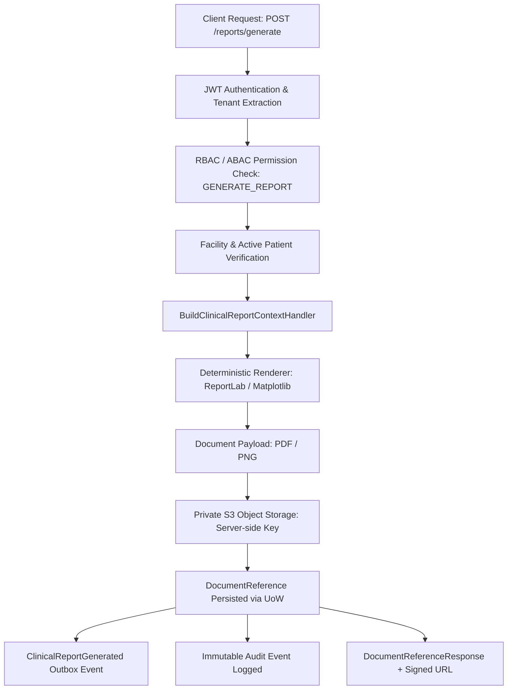

# GATE 10N — REPORTS + DOCUMENTS + S3 IMPLEMENTATION REPORT
**THALI + P.L.A.T.E. Assistive Diabetes-Care Workflow Platform**

---

## 1. Executive Summary & Verification Matrix

Gate 10N introduces a **server-authoritative clinical and patient report generation and document storage pipeline** integrated with private S3 object storage, multi-tenant database persistence, PostgreSQL Row Level Security (RLS), and comprehensive role- and relationship-based access control.

### Frozen Lineage & Baseline
- **Base Tag:** `gate-10m-ai-generation-sealed`
- **Base Commit:** `a27a91ed20d4a64bc3f8c5af08667851ee801f3d`
- **Branch:** `feature/gate-10n-reports-documents`
- **Sealing Tag:** `gate-10n-reports-documents-sealed`

### Verification Summary
- **Backend Full Regression Suite:** 779 passed, 0 failures (100% pass across repository)
- **Gate 10N API Test Suite:** 30 passed, 0 failures (`tests/api/test_gate_10n_reports_documents.py`)
- **Live PostgreSQL RLS Test:** 1 passed, 0 failures (`tests/integration/test_gate_10n_documents_rls.py`)
- **Mobile Test Suite:** 300 passed, 0 failures (`apps/mobile`)
- **Admin Web Test Suite:** 41 passed, 0 failures (`apps/admin-web`)
- **Static Security & DTO Scans:** 0 violations, 0 client-exposed credentials, 0 path traversals, 0 CDS, 0 carbs leakage to patient

---

## 2. Core Architectural Invariants Enforced

1. **Server-Authoritative Document Pipeline:**
   - Reports are never built client-side. The server aggregates evidence, formats, renders, uploads to private S3 storage, and creates database records atomically.
   - Zero client access to raw storage credentials; all downloads are mediated via short-lived signed URLs (300s) or streaming proxy endpoints.
2. **Private S3 Storage & Key Sanitization:**
   - Private bucket only (`thali-documents`).
   - Server-side key pattern: `tenants/{tenant_id}/patients/{patient_id}/{kind}/{document_id}.{ext}`.
   - Strict path traversal protection rejects `..`, empty keys, or leading slashes.
3. **Multi-Tenant PostgreSQL Row Level Security (RLS):**
   - Migration `0008_document_references.py` establishes `document_references` with forced RLS.
   - Tenant isolation policy: `tenant_id = NULLIF(current_setting('app.current_tenant_id', true), '')::uuid`.
   - Missing tenant context fails closed (0 rows visible).
4. **Scoping & Relationship Authorization:**
   - Clinicians are facility-scoped (`assert_authorized_clinician_facility`).
   - Patients can access only their own documents (`identity_patient_mappings`).
   - Caregivers can access documents only with an active, `verified` relationship and non-expired grant.
   - Deactivated patients (`active=False`) are rejected with `403 Forbidden`.
   - Cross-tenant access is rejected with `404 Not Found`.
5. **Information Asymmetry & Clinical Safety:**
   - Patient-facing reports (`patient_summary`) strictly omit analytical carbohydrate grams (`carbs_grams`) and glycemic index (`glycemic_index`).
   - Patient reports strictly omit technical AI metadata (`model_name`, `evidence_hash`, prompt internals).
   - Only clinician-approved or edited summaries are surfaced in patient summaries.
   - `MedicationPlan` entities are rendered in read-only format; zero titration, mutation, or autonomous clinical decision support.
   - Mandatory statutory disclaimers are rendered on every report.

---

## 3. Implementation Components

### Domain Layer
- **`DocumentReference` Entity** (`backend/domain/entities/document_reference.py`):
  Extended with `tenant_id`, `facility_id`, `created_by_user_id`, `file_size_bytes`, `filename`, `correlation_id`.
  Added `DocumentKind.PATIENT_SUMMARY`.
- **Domain Event** (`backend/domain/events/clinical.py`):
  Added `ClinicalReportGenerated(document_id, patient_id)`.

### Storage Adapter
- **`IObjectStorage` Port** (`backend/application/ports/storage.py`):
  Defined `put`, `get`, `delete`, `exists`, `generate_presigned_url`.
- **`S3ObjectStorage` Adapter** (`backend/infrastructure/storage/s3_storage.py`):
  Implemented with private S3/MinIO support, fallback memory store, path traversal defense, and server-side key builder `build_storage_key`.

### Persistence & Migrations
- **Alembic Migration** (`backend/infrastructure/persistence/alembic/versions/0008_document_references.py`):
  Creates `document_references` table, indices on `(tenant_id, patient_id)`, `(tenant_id, created_at)`, `(tenant_id, kind)`.
  Enables and forces PostgreSQL RLS with `tenant_isolation_document_references` policy.
  Grants permissions to `thali_app_role` and `thali_app_test_role`.
- **ORM Model & Mappers** (`backend/infrastructure/persistence/models/document_models.py`, `mappers.py`):
  `DocumentReferenceModel` and bidirectional domain entity mappers.
- **Repository & UnitOfWork** (`backend/infrastructure/persistence/repositories/document_reference_repo.py`, `sqlalchemy_uow.py`):
  `SqlAlchemyDocumentReferenceRepository` and UnitOfWork registration.

### Application Services & Renderers
- **`BuildClinicalReportContextHandler`** (`backend/application/services/build_clinical_report_context.py`):
  Assembles observations, meals, medication plans, care tasks, and AI artifacts with strict DTO asymmetry.
- **Deterministic Renderers** (`backend/infrastructure/reporting/report_renderer.py`):
  `ClinicalPdfRenderer` (ReportLab): Multi-section clinical summary with glucose statistics, meal details, active medications, care tasks, and AI review queue.
  `PatientPdfRenderer` (ReportLab): Patient-friendly summary omitting carbs/GI and internal hashes.
  `PngChartRenderer` (Matplotlib headless): 24-hour ambulatory glucose trend chart.
- **Commands & Handlers**:
  `GenerateReportHandler` (`backend/application/services/generate_report.py`)
  `UploadDocumentHandler` (`backend/application/services/upload_document.py`)

### HTTP API Endpoints
- `POST /api/v2/clinical/reports/generate` — Generate report (PDF/PNG) and store in S3
- `GET /api/v2/clinical/patients/{patient_id}/documents` — List patient documents
- `GET /api/v2/clinical/documents/{document_id}` — Document reference metadata
- `GET /api/v2/clinical/documents/{document_id}/download` — Download document stream or presigned URL
- `POST /api/v2/clinical/patients/{patient_id}/documents/upload` — Upload external chart/doc (JSON base64)
- `GET /api/v2/patients/{patient_id}/documents` — Patient portal document list
- `GET /api/v2/admin/documents` — Tenant-scoped document list (admin only)

---

## 4. Requirement Verification Matrix

| # | Requirement / Invariant | Test Method | Status |
|---|---|---|---|
| 1 | Clinical summary PDF generation | `test_generate_clinical_report_pdf` | PASSED |
| 2 | Clinical summary PNG chart generation | `test_generate_clinical_report_png` | PASSED |
| 3 | Patient summary PDF generation | `test_generate_patient_summary_pdf` | PASSED |
| 4 | Server-side private key structure | `test_report_storage_private_key_structure` | PASSED |
| 5 | Path traversal protection (`..`, `/`) | `test_report_storage_path_traversal_rejected` | PASSED |
| 6 | Unauthenticated storage read rejection (401) | `test_report_storage_no_public_reads` | PASSED |
| 7 | Presigned URL generation (300s expiry) | `test_presigned_download_url` | PASSED |
| 8 | Direct streaming download with headers | `test_direct_stream_download` | PASSED |
| 9 | Patient self-read own document list | `test_patient_self_read_own_document` | PASSED |
| 10 | Patient cross-patient read denied (403) | `test_patient_cannot_read_other_patient_document` | PASSED |
| 11 | Verified caregiver document read | `test_caregiver_read_verified_patient_document` | PASSED |
| 12 | Unverified caregiver read denied (403) | `test_caregiver_cannot_read_unverified_patient_document` | PASSED |
| 13 | Expired caregiver grant denied (403) | `test_caregiver_expired_relationship_denied` | PASSED |
| 14 | Clinician facility-scoped access | `test_clinician_facility_scoped_access` | PASSED |
| 15 | Clinician cross-facility access denied (403) | `test_clinician_cross_facility_denied` | PASSED |
| 16 | Deactivated patient generation denied (403) | `test_deactivated_patient_denied` | PASSED |
| 17 | Admin tenant-scoped document listing | `test_admin_tenant_scoped_read` | PASSED |
| 18 | Admin cross-tenant read denied (404) | `test_admin_cross_tenant_denied` | PASSED |
| 19 | DTO asymmetry: NO carbs/GI in patient report | `test_patient_summary_dto_asymmetry_no_carbs_no_gi` | PASSED |
| 20 | DTO asymmetry: NO AI model/hashes in patient report | `test_patient_summary_omits_ai_internal_hashes` | PASSED |
| 21 | MedicationPlan read-only representation | `test_medication_plan_read_only_in_report` | PASSED |
| 22 | AI artifact review state preserved | `test_ai_artifact_review_state_preserved` | PASSED |
| 23 | Idempotency on report generation | `test_idempotency_generate_report` | PASSED |
| 24 | Valid document upload (PDF) | `test_document_upload_valid_pdf` | PASSED |
| 25 | Invalid MIME type rejected (400) | `test_document_upload_invalid_mime_rejected` | PASSED |
| 26 | Document upload file size limit (10MB, 413) | `test_document_upload_size_limit_enforced` | PASSED |
| 27 | Audit event recorded on report generation | `test_audit_event_logged_on_report_generation` | PASSED |
| 28 | Audit event recorded on document download | `test_audit_event_logged_on_document_download` | PASSED |
| 29 | Unauthenticated report generation denied (401) | `test_unauthenticated_request_denied` | PASSED |
| 30 | Unauthorized role denied report generation (403) | `test_unauthorized_role_denied` | PASSED |
| 31 | PostgreSQL RLS enforcement on `document_references` | `TestDocumentReferencesRLSPostgres` | PASSED |
