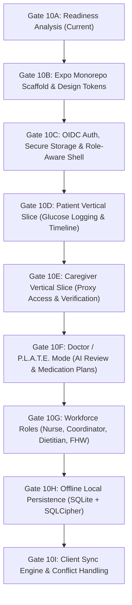

# GATE 10A — UNIVERSAL MOBILE FRONTEND READINESS ANALYSIS
**THALI × P.L.A.T.E. Production Program**  
**Role**: Principal Frontend / Platform Architect  
**Status**: READ-ONLY READINESS AUDIT  
**Date**: 2026-09-16  

---

## 1. EXECUTIVE SUMMARY

This audit establishes the definitive architectural readiness assessment for **Gate 10: Universal Mobile Application** within the unified **THALI × P.L.A.T.E.** platform.

### Core Findings
1. **Repository State**: The repository is currently **backend-only** (Category A). The directory [`apps/mobile`](file:///Users/subhamdas/Documents/health-a-thon-BioCypher--master/apps/mobile) contains only an architectural boundary README. There are no existing `package.json`, `tsconfig.json`, `app.json`, `node_modules`, or React Native / Expo assets anywhere in the repository.
2. **Backend Freeze**: The backend architecture is strictly frozen through Gate 08 (`cf163ed`, relational identity) and Gate 09 (`d7d1557`, operational resiliency). All 436 regression tests and 11 architectural boundary tests pass with 100% compliance.
3. **Information Asymmetry Guarantee**: The core clinical safety invariant—that patient-facing interfaces must **never** expose carbohydrate grams, glycemic index calculations, or unsupported clinical risk interpretations—is architecturally enforced at the domain entity and DTO level (`PatientObservationFeedResponse`).
4. **Backend API Readiness**: The HTTP v2 layer exposes 14 operational endpoints + 2 health endpoints. Core endpoints necessary for the first end-to-end patient vertical slice (`/api/v2/auth/verify`, `GET /api/v2/clinical/observations`, `POST /api/v2/clinical/observations`) are fully implemented, tested against live PostgreSQL, and protected by Gate 09 idempotency, rate limiting, and immutable audit trails.
5. **Implementation Feasibility**: Implementation is **READY** to begin with Gate 10B (Expo monorepo scaffolding & design tokens) and Gate 10C (authentication shell), with explicit hard stops and backend endpoint expansions identified for subsequent vertical slices.

---

## 2. REPOSITORY SNAPSHOT

Empirical inspection of the physical workspace reveals the following baseline:

- **Repository Root**: `/Users/subhamdas/Documents/health-a-thon-BioCypher--master`
- **Current Branch**: `feature/gate-09-operational-resiliency`
- **HEAD Commit**: `d7d1557dfe572f740d2739ef48ef4106e555aa5e`
- **Latest Gate 09 Commit**: `d7d1557dfe572f740d2739ef48ef4106e555aa5e` (`feat(ops): implement operational resiliency and channel orchestration`)
- **Gate 09 Tags**: `gate-09-operational-resiliency-complete` (audit verdict: `APPROVE / SEAL`; intended final tag: `gate-09-operational-resiliency-sealed`)
- **Working-Tree Status**: Clean tracked working tree; untracked files restricted strictly to architecture documentation in `docs/migration/`.
- **Frontend Directories**:
  - [`apps/mobile/`](file:///Users/subhamdas/Documents/health-a-thon-BioCypher--master/apps/mobile): Contains only `README.md` (Gate 02B boundary).
  - [`apps/admin-web/`](file:///Users/subhamdas/Documents/health-a-thon-BioCypher--master/apps/admin-web): Contains only `README.md` (Gate 02B boundary).
  - [`apps/clinical-workstation/`](file:///Users/subhamdas/Documents/health-a-thon-BioCypher--master/apps/clinical-workstation): Contains only `README.md` (Phase 2 optional boundary).
  - [`apps/legacy-dashboard/`](file:///Users/subhamdas/Documents/health-a-thon-BioCypher--master/apps/legacy-dashboard): Contains only `README.md` (archival target).
  - [`app/static/`](file:///Users/subhamdas/Documents/health-a-thon-BioCypher--master/app/static): Contains legacy prototype assets (`index.html`, `style.css`, `app.js`).
- **Backend Directories**:
  - [`backend/domain/`](file:///Users/subhamdas/Documents/health-a-thon-BioCypher--master/backend/domain): Pure Python standard library domain entities, value objects, domain events, and invariants.
  - [`backend/application/`](file:///Users/subhamdas/Documents/health-a-thon-BioCypher--master/backend/application): Commands, queries, handlers, DTOs, ports, and operational workers.
  - [`backend/infrastructure/`](file:///Users/subhamdas/Documents/health-a-thon-BioCypher--master/backend/infrastructure): Adapters for PostgreSQL, SQLAlchemy 2.x, Alembic, Redis cache, rate limiting, and reporting.
  - [`backend/interfaces/http/`](file:///Users/subhamdas/Documents/health-a-thon-BioCypher--master/backend/interfaces/http): FastAPI v2 routing, authentication dependencies, scoping, idempotency, rate limit, and audit middleware.
  - [`app/`](file:///Users/subhamdas/Documents/health-a-thon-BioCypher--master/app): Legacy Aahaar v1 server (`app/server/main.py`), core logic, and prototype reporting engine.
- **Test Suites**:
  - [`tests/unit/`](file:///Users/subhamdas/Documents/health-a-thon-BioCypher--master/tests/unit): Domain, application, and clean-architecture boundary tests.
  - [`tests/integration/`](file:///Users/subhamdas/Documents/health-a-thon-BioCypher--master/tests/integration): Live PostgreSQL tests, Alembic migration verification, outbox worker, and idempotency concurrency tests.
  - [`tests/contract/`](file:///Users/subhamdas/Documents/health-a-thon-BioCypher--master/tests/contract): DTO and schema contract compliance tests.
- **Documentation**: Root architectural specs (`GATE_00` through `GATE_02A`) and `docs/migration/` records (`GATE_03` through `GATE_09`).
- **Scripts**: Diagnostic and seeding utilities in `scripts/`.
- **Package Manifests**:
  - Node/JS: **None**. Zero `package.json`, `pnpm-workspace.yaml`, or lockfiles.
  - Python: `requirements.txt` (frozen dependencies), `alembic.ini`, `pytest.ini`.
- **Configuration Files**: `.env.example`, [`config/settings.py`](file:///Users/subhamdas/Documents/health-a-thon-BioCypher--master/config/settings.py).

**Repository Classification**: **A. Backend-Only** (with isolated legacy vanilla JS static demo dashboard in `app/static`).

---

## 3. GIT & LINEAGE VERIFICATION

- **Lineage**:
  - `cf163ed` (`gate-08-relational-identity-sealed`)
  - └── `d7d1557` (`gate-09-operational-resiliency-complete` / `HEAD`)
- **Linearity**: Zero merge commits in `cf163ed..HEAD`. Direct single-parent descent verified via `git merge-base --is-ancestor`.
- **Working Tree**: `git diff --check` and `git diff` show 0 modified tracked files. The backend boundary is fully sealed and immutable.

---

## 4. EXISTING FRONTEND INVENTORY

| Artifact | Type | Status / Disposition | Rationale |
| :--- | :--- | :--- | :--- |
| [`app/static/index.html`](file:///Users/subhamdas/Documents/health-a-thon-BioCypher--master/app/static/index.html) | Legacy HTML5 | **ISOLATE** | Served by legacy `app/server/main.py` for prototype demo and baseline regression tests. Do not alter or import into mobile. |
| [`app/static/app.js`](file:///Users/subhamdas/Documents/health-a-thon-BioCypher--master/app/static/app.js) | Legacy Vanilla JS | **ISOLATE / REPLACE** | Direct prototype polling against v1 SQLite endpoints. Replaced entirely by the React Native client. |
| [`app/static/style.css`](file:///Users/subhamdas/Documents/health-a-thon-BioCypher--master/app/static/style.css) | Legacy CSS3 | **ISOLATE / REPLACE** | Custom legacy CSS styles. Replaced by React Native style system and tokens. |
| [`apps/mobile/README.md`](file:///Users/subhamdas/Documents/health-a-thon-BioCypher--master/apps/mobile/README.md) | Boundary Markdown | **ADAPT** | Target directory for the universal Expo app scaffold in Gate 10B. |
| [`apps/admin-web/README.md`](file:///Users/subhamdas/Documents/health-a-thon-BioCypher--master/apps/admin-web/README.md) | Boundary Markdown | **KEEP / ISOLATE** | Reserved boundary for administrative web portal (Gate 11). |
| [`apps/clinical-workstation/README.md`](file:///Users/subhamdas/Documents/health-a-thon-BioCypher--master/apps/clinical-workstation/README.md) | Boundary Markdown | **KEEP / ISOLATE** | Phase 2 optional workstation. Not touched in Gate 10. |
| [`apps/legacy-dashboard/README.md`](file:///Users/subhamdas/Documents/health-a-thon-BioCypher--master/apps/legacy-dashboard/README.md) | Boundary Markdown | **KEEP** | Future destination for `app/static/*` once cutover occurs. |

**Zero Active Mobile Artifacts**: No existing React Native, Expo, TypeScript, or Babel configs exist. All mobile scaffolding will be created fresh under `apps/mobile/`.

---

## 5. LEGACY AAHAR CONTAINMENT

To guarantee architectural integrity during Gate 10 implementation:
1. **Strict Legacy Quarantine**:
   - `app/server/main.py`, `app/core/*`, `app/report/*`, and `app/static/*` represent the legacy prototype system.
   - The new universal mobile application under `apps/mobile/` must **never** import or make HTTP requests to legacy `/api/v1/*` endpoints.
   - All mobile traffic is restricted to target API v2 endpoints (`/api/v2/*`).
2. **Reusable Conceptual Assets**:
   - The Katori portion measurement model (0.5, 1.0, 1.5, 2.0 katori sizing) and meal intake tagging logic remain valid conceptual guidelines, but their implementations are imported exclusively through backend domain models (`backend/domain/value_objects/portion.py`), never legacy code.
3. **Deprecation Strategy**:
   - Legacy files remain untouched in place until all mobile vertical slices are delivered and verified. Physical movement of `app/static/*` to `apps/legacy-dashboard/` will occur during the final decommission phase.

---

## 6. BACKEND API CONTRACT INVENTORY

Detailed audit of all HTTP v2 routes currently mounted in [`backend/interfaces/http/v2/router.py`](file:///Users/subhamdas/Documents/health-a-thon-BioCypher--master/backend/interfaces/http/v2/router.py):

| Method | Path | Auth Requirement | Role / Capability | Tenant Scope | Relationship Requirement | Request DTO | Response DTO | Error Codes | Idempotency | Offline Safe? | Status |
| :--- | :--- | :--- | :--- | :--- | :--- | :--- | :--- | :--- | :--- | :--- | :--- |
| `GET` | `/health/live` | None | Public | None | None | None | `LivenessResponse` | None | Bypass | Yes | **IMPLEMENTED** |
| `GET` | `/health/ready` | None | Public | None | None | None | `ReadinessResponse` | `503` | Bypass | Yes | **IMPLEMENTED** |
| `GET` | `/api/v2/auth/verify` | Bearer JWT | Any authenticated role | JWT `tenant_id` | None | None | `AuthVerifyResponse` | `401`, `429` | Bypass | No | **IMPLEMENTED** |
| `GET` | `/api/v2/clinical/observations` | Bearer JWT | `READ_OBSERVATIONS` (Patient, Caregiver, Doctor, Nurse, Dietitian, FHW, Coord) | JWT `tenant_id` | Patient self-mapping; Caregiver `READ_GLUCOSE` + `READ_MEAL`; Clinician facility match | Query: `patient_id`, `limit` | `PatientObservationFeedResponse` | `400`, `401`, `403`, `404`, `429` | Bypass | Yes (Cached query) | **IMPLEMENTED** |
| `POST` | `/api/v2/clinical/observations` | Bearer JWT | `WRITE_OBSERVATIONS` (Patient, Caregiver, Doctor, Nurse, Dietitian, FHW) | JWT `tenant_id` | Patient self-mapping; Caregiver `CREATE_GLUCOSE`; Clinician facility match | `IngestGlucoseRequest` | `IngestGlucoseResponse` | `400`, `401`, `403`, `404`, `409`, `429` | **REQUIRED** (`Idempotency-Key`) | Yes (Queue in Outbox) | **IMPLEMENTED** |
| `POST` | `/api/v2/clinical/medication-plans` | Bearer JWT | `WRITE_MEDICATION_PLANS` (Doctor, Nurse, Dietitian) | JWT `tenant_id` | Clinician facility match (`CareTeamRole.can_author_medication`) | `CreateMedicationPlanRequest` | `CreateMedicationPlanResponse` | `400`, `401`, `403`, `404`, `409`, `429` | **REQUIRED** (`Idempotency-Key`) | No (Clinician authoritative) | **IMPLEMENTED** |
| `POST` | `/api/v2/clinical/ai-artifacts/{id}/review` | Bearer JWT | `REVIEW_AI_ARTIFACT` (Doctor, Nurse, Dietitian) | JWT `tenant_id` | Clinician facility match | `ReviewAIArtifactRequest` | `ReviewAIArtifactResponse` | `400`, `401`, `403`, `404`, `409`, `429` | **REQUIRED** (`Idempotency-Key`) | No (Clinician authoritative) | **IMPLEMENTED** |
| `POST` | `/api/v2/patients/{id}/caregivers` | Bearer JWT | `MANAGE_CAREGIVER_RELATIONSHIPS` (Care Coordinator, Admin) | JWT `tenant_id` | Coordinator facility match | `RegisterCaregiverRequest` | `CaregiverRelationshipResponse` | `400`, `401`, `403`, `404`, `409`, `429` | **REQUIRED** (`Idempotency-Key`) | No | **IMPLEMENTED** |
| `GET` | `/api/v2/patients/{id}/caregivers` | Bearer JWT | `MANAGE_CAREGIVER_RELATIONSHIPS` (Care Coordinator, Admin) | JWT `tenant_id` | Coordinator facility match | None | `CaregiverRelationshipListResponse` | `400`, `401`, `403`, `404`, `429` | Bypass | Yes (Cached query) | **IMPLEMENTED** |
| `PATCH` | `/api/v2/patients/{id}/caregivers/{rel_id}/verify` | Bearer JWT | `MANAGE_CAREGIVER_RELATIONSHIPS` (Care Coordinator, Admin) | JWT `tenant_id` | Coordinator facility match | None | `CaregiverRelationshipResponse` | `400`, `401`, `403`, `404`, `409`, `429` | **REQUIRED** (`Idempotency-Key`) | No | **IMPLEMENTED** |
| `DELETE` | `/api/v2/patients/{id}/caregivers/{rel_id}` | Bearer JWT | `MANAGE_CAREGIVER_RELATIONSHIPS` (Care Coordinator, Admin) | JWT `tenant_id` | Coordinator facility match | None | `CaregiverRelationshipResponse` | `400`, `401`, `403`, `404`, `409`, `429` | **REQUIRED** (`Idempotency-Key`) | No | **IMPLEMENTED** |
| `POST` | `/api/v2/admin/identity-mappings` | Bearer JWT | `MANAGE_IDENTITY_MAPPINGS` (Admin only) | JWT `tenant_id` | Admin tenant scope | `CreateIdentityMappingRequest` | `IdentityMappingResponse` | `400`, `401`, `403`, `409`, `429` | **REQUIRED** (`Idempotency-Key`) | No | **IMPLEMENTED** |
| `GET` | `/api/v2/admin/identity-mappings` | Bearer JWT | `MANAGE_IDENTITY_MAPPINGS` (Admin only) | JWT `tenant_id` | Admin tenant scope | None | `list[IdentityMappingResponse]` | `401`, `403`, `429` | Bypass | No | **IMPLEMENTED** |
| `POST` | `/api/v2/admin/identity-mappings/{id}/deactivate` | Bearer JWT | `MANAGE_IDENTITY_MAPPINGS` (Admin only) | JWT `tenant_id` | Admin tenant scope | None | `IdentityMappingResponse` | `400`, `401`, `403`, `404`, `409`, `429` | **REQUIRED** (`Idempotency-Key`) | No | **IMPLEMENTED** |
| `GET` | `/api/v2/admin/audit-events` | Bearer JWT | `admin` role | JWT `tenant_id` | Admin tenant scope | Query: `limit`, `actor_id`, `action` | `list[AuditEventResponse]` | `400`, `401`, `403`, `429` | Bypass | No | **IMPLEMENTED** |
| `GET` | `/api/v2/webhooks/whatsapp` | Hub Verify Token | WhatsApp provider verification | None | None | Query params | `WhatsAppVerifyResponse` | `403` | Bypass | No | **IMPLEMENTED** |
| `POST` | `/api/v2/webhooks/whatsapp` | HMAC-SHA256 Header | Meta Webhook Inbound | Dynamic resolution via phone lookup | Phone number binding | Raw JSON payload | `WhatsAppInboundResponse` | `400`, `401`, `503` | Handled via receipt store | No | **IMPLEMENTED** |

### Endpoint Inventory Gaps (To be mounted in future backend gates)
- `POST /api/v2/auth/login` (OIDC handled externally via Keycloak, but mock token helper needed for dev): **NOT IMPLEMENTED**
- `GET /api/v2/patients` (Patient list for clinicians/caregivers): **NOT IMPLEMENTED** in HTTP v2 (repo port exists).
- `GET /api/v2/patients/{id}` (Patient detail & demographics): **NOT IMPLEMENTED** in HTTP v2 (repo port exists).
- `POST /api/v2/clinical/meals` (Meal draft logging): **NOT IMPLEMENTED** in HTTP v2 (`LogMealDraftHandler` exists in application layer).
- `POST /api/v2/clinical/meals/{id}/confirm` (Meal portion confirmation): **NOT IMPLEMENTED** in HTTP v2 (`ConfirmMealObservationHandler` exists).
- `POST /api/v2/clinical/medication-administrations` (Adherence logging): **NOT IMPLEMENTED** in HTTP v2 (`RecordMedicationAdministrationHandler` exists).
- `GET /api/v2/clinical/medication-plans` (List active plans for patient): **NOT IMPLEMENTED** in HTTP v2.
- `GET /api/v2/care-tasks` & `POST /api/v2/care-tasks/{id}/complete`: **NOT IMPLEMENTED** in HTTP v2 (`CompleteCareTaskHandler` exists).
- `POST /api/v2/documents` (Report/document upload): **NOT IMPLEMENTED** in HTTP v2.
- `GET /api/v2/clinical/ai-artifacts`: **NOT IMPLEMENTED** in HTTP v2 (only review endpoint exists).
- `POST /api/v2/clinical/reports`: **NOT IMPLEMENTED** in HTTP v2 (reporting service exists in infrastructure).

---

## 7. AUTHENTICATION CLIENT CONTRACT

The mobile client interacts with Keycloak via **OAuth 2.0 / OIDC Authorization Code Flow with PKCE** (RFC 7636).

### Configuration Boundaries
- **Client-Safe Configuration** (Embedded in mobile application bundle or config):
  - `KEYCLOAK_ISSUER_URL`: e.g. `http://<host>:8080/realms/thali`
  - `KEYCLOAK_REALM`: `thali`
  - `KEYCLOAK_CLIENT_ID`: `thali-mobile-app` (Configured in Keycloak as a **Public Client** with PKCE enabled).
  - `REDIRECT_URI`: `thali://auth/callback`
  - `SCOPES`: `openid profile email offline_access`
- **Server-Only Configuration** (STRICTLY FORBIDDEN from mobile binary):
  - `client_secret`: Keycloak confidential client secrets must **never** exist on device.
  - `JWT_SECRET`: HS256 HMAC secret used by FastAPI backend for internal testing/validation.
  - `DATABASE_URL`, `WHATSAPP_APP_SECRET`, `S3_SECRET_KEY`: Backend operational secrets.

### JWT Claims Required by Backend Dependency (`get_authenticated_context`)
The JWT presented to FastAPI must contain:
```json
{
  "iss": "http://localhost:8080/realms/thali",
  "sub": "3fa85f64-5717-4562-b3fc-2c963f66afa6",
  "tenant_id": "c7a85f64-5717-4562-b3fc-2c963f66afa7",
  "realm_access": {
    "roles": ["patient"]
  },
  "facility_id": "d8a85f64-5717-4562-b3fc-2c963f66afa8",
  "preferred_username": "patient_ramesh",
  "exp": 1726488000
}
```
- Missing `tenant_id` or non-UUID `sub` triggers immediate `401 Unauthorized`.
- Token expiration triggers silent refresh via refresh token using PKCE grant.

---

## 8. AUTHORIZATION MATRIX

The backend enforces strict deny-by-default authorization via [`RelationshipAuthorizationPolicy`](file:///Users/subhamdas/Documents/health-a-thon-BioCypher--master/backend/interfaces/http/v2/security/authorization.py) and [`scoping.py`](file:///Users/subhamdas/Documents/health-a-thon-BioCypher--master/backend/interfaces/http/v2/security/scoping.py). The mobile UI responds adaptively to these capabilities:

| Role | Permitted Backend Capabilities | Mobile App Surface Mode | Backend Scoping Rule | UI Denial Behavior |
| :--- | :--- | :--- | :--- | :--- |
| **Patient** | `READ_OBSERVATIONS`, `WRITE_OBSERVATIONS`, `READ_PATIENT` | **Patient Mode** (Home, Glucose, Food, Care, More) | Must have active `IdentityPatientMapping` matching `patient_id`. | Display "Account not linked to patient record. Contact clinic administrator." |
| **Caregiver** | Scoped capabilities: `READ_GLUCOSE`, `READ_MEAL`, `CREATE_GLUCOSE`, `CREATE_MEAL`, etc. | **Caregiver Mode** (Home, Patients, Verify, Messages, More) | Must have `VERIFIED`, non-expired `CaregiverRelationship` with granted capabilities. | If pending: "Verification pending by clinic coordinator." If revoked: "Access revoked." |
| **Doctor** | All clinical ops: read/write obs, read/write med plans, read/review AI, read/write patient | **Doctor Mode (P.L.A.T.E.)** (Home, Review, Patients, Tasks, More) | Active `CareTeamMember` whose `facility_id` matches `patient.facility_id`. | `403 Forbidden`: "Patient outside authorized facility." Redirection to assigned cohort. |
| **Nurse** | Read/write obs, read/write med plans, read/review AI, read patient | **Nurse Mode** (Home, Patients, Capture, Tasks, More) | Active `CareTeamMember` whose `facility_id` matches `patient.facility_id`. | Display facility mismatch banner; block clinical inputs. |
| **Care Coordinator** | Read obs, read med plans, read AI, read/write patient, `MANAGE_CAREGIVER_RELATIONSHIPS` | **Coordinator Mode** (Queue, Patients, Tasks, More) | Active `CareTeamMember` whose `facility_id` matches `patient.facility_id`. | Relationship actions disabled outside facility. |
| **Dietitian** | Read/write obs, read/write med plans, read/review AI, read patient | **Dietitian Mode** (Patients, Food, Tasks, More) | Active `CareTeamMember` whose `facility_id` matches `patient.facility_id`. | Medication authoring restricted if role lacks clinician permission. |
| **Field Health Worker** | `READ_OBSERVATIONS`, `WRITE_OBSERVATIONS`, `READ_PATIENT` | **FHW Mode** (Visits, Capture, Tasks, More) | Active `CareTeamMember` whose `facility_id` matches `patient.facility_id`. | Clinical review screens hidden; data capture enabled. |

### Negative Lifecycle Scenarios
- **Deactivated Identity**: If `IdentityPatientMapping.active == False`, patient receives `403 Access Denied` on all patient endpoints. UI immediately clears session and navigates to deactivation notice.
- **Revoked Caregiver**: If relationship status is `revoked`, access is denied immediately by backend policy. UI removes patient from caregiver patient switcher.
- **Expired Relationship**: If `clock.now() > relationship.expires_at`, policy denies access. UI displays renewal banner.

---

## 9. API CLIENT ARCHITECTURE

The frontend API layer will be structured as follows:

```
apps/mobile/src/services/api/
├── client.ts              # Custom Fetch / Axios instance with interceptors
├── endpoints/             # Endpoint definitions grouped by domain
│   ├── auth.ts
│   ├── clinical.ts
│   ├── caregivers.ts
│   └── admin.ts
├── interceptors/
│   ├── authInterceptor.ts      # Injects Bearer token from secure storage
│   ├── correlationInterceptor.ts# Generates X-Correlation-ID UUIDv4
│   ├── idempotencyInterceptor.ts# Injects Idempotency-Key for mutations
│   └── errorInterceptor.ts    # Centralized HTTP error handling
└── types/                 # Zod runtime schemas & TypeScript types
```

### Interceptor & Error Handling Matrix
- **`Authorization: Bearer <token>`**: Injected on all authenticated requests. If missing or token expired, triggers PKCE token refresh before sending request.
- **`X-Correlation-ID`**: Generated as a cryptographically secure UUIDv4 for each request and logged locally.
- **`Idempotency-Key`**: Generated as a UUIDv4 on all state-changing mutations (`POST`, `PATCH`, `DELETE`). Stored alongside local pending mutation.
- **`HTTP 401 Unauthorized`**: Wipe auth state from secure storage, route user to Login screen.
- **`HTTP 403 Forbidden`**: Display context-aware permissions alert (facility mismatch, revoked relationship, or unlinked identity). Never retry.
- **`HTTP 404 Not Found`**: Display empty state / item missing notification.
- **`HTTP 409 Conflict`**:
  - Code `CONCURRENT_REQUEST_IN_PROGRESS`: Retry with exponential backoff (1s, 2s, 4s).
  - Code `IDEMPOTENCY_KEY_MISMATCH`: Critical bug; regenerate key and notify user.
- **`HTTP 422 Unprocessable Entity`**: Map backend field errors directly to React Hook Form field validation states.
- **`HTTP 429 Too Many Requests`**: Parse `Retry-After` header and pause subsequent requests until window expires.
- **Network Disconnect**: If offline, queue mutations in local offline outbox table; resolve queries from TanStack Query cache or SQLite mirror.

---

## 10. STATE MANAGEMENT ARCHITECTURE

To prevent monolithic state pollution, application state is strictly partitioned into 5 independent tiers:

```
┌─────────────────────────────────────────────────────────────┐
│ 1. Server State: TanStack Query (@tanstack/react-query)     │
│    - Query caches, optimistic updates, query invalidation    │
├─────────────────────────────────────────────────────────────┤
│ 2. Local UI State: Zustand                                  │
│    - Active tab, modal visibility, filter drawers, theme    │
├─────────────────────────────────────────────────────────────┤
│ 3. Form State: React Hook Form                              │
│    - Uncontrolled form inputs, input focus, dirty tracking   │
├─────────────────────────────────────────────────────────────┤
│ 4. Form & DTO Validation: Zod                               │
│    - Runtime schema parsing, validation schemas              │
├─────────────────────────────────────────────────────────────┤
│ 5. Secure Session State: expo-secure-store                  │
│    - JWT access token, refresh token, actor_id, tenant_id   │
├─────────────────────────────────────────────────────────────┤
│ 6. Offline Domain State: Expo SQLite + SQLCipher + Drizzle   │
│    - Encrypted local observation store, sync outbox queue    │
└─────────────────────────────────────────────────────────────┘
```

### Prohibited in Zustand
- **Server Domain Entities**: Never store raw patient lists, observations, or medication plans in Zustand.
- **Sensitive Tokens**: Never store JWTs or refresh tokens in Zustand memory stores or unencrypted AsyncStorage.
- **Form Values**: Uncontrolled inputs belong in React Hook Form.

---

## 11. OFFLINE-FIRST READINESS

Offline functionality is designed around an encrypted local mirror and client outbox queue:

### Local Database Architecture (Drizzle ORM + SQLCipher)
1. **`local_observations`**:
   - `local_id` (UUID PK)
   - `server_id` (UUID, nullable)
   - `kind` (`glucose` | `meal`)
   - `payload_json` (JSON blob)
   - `observed_at` (ISO timestamp)
   - `captured_at` (ISO timestamp)
   - `device_id` (UUID)
   - `sync_status` (`PENDING`, `SYNCED`, `FAILED`)
   - `idempotency_key` (UUID)
2. **`client_outbox`**:
   - `outbox_id` (UUID PK)
   - `method` (`POST`, `PATCH`, `DELETE`)
   - `endpoint` (URL path)
   - `payload` (JSON)
   - `idempotency_key` (UUID)
   - `attempts` (Integer)
   - `last_error` (Text)
   - `status` (`ENQUEUED`, `PROCESSING`, `FAILED`)

### Separation of Concerns
- **Mobile Local Store**: Responsible for immediate local writes, optimistic UI rendering, and storing offline capture timestamps.
- **Client Sync Engine**: Dispatches enqueued outbox events when network connectivity is detected; participates in server idempotency using cached `idempotency_key`.
- **Backend Server Outbox**: Authoritative event sourcing and external message broker dispatch; completely separate from mobile client outbox.

---

## 12. DOMAIN-TO-MOBILE MODEL MAPPING

| Domain Entity (Backend) | Server DTO (FastAPI) | Mobile View Model (TS) | Form Model (RHF + Zod) | Local Storage Model (Drizzle) |
| :--- | :--- | :--- | :--- | :--- |
| `GlucoseObservation` | `PatientGlucoseObservationResponse` | `GlucoseReading` | `GlucoseInputForm` | `local_observations` (`kind='glucose'`) |
| `MealObservation` | `PatientMealObservationResponse` | `MealObservation` | `MealCaptureForm` | `local_observations` (`kind='meal'`) |
| `MedicationPlan` | `MedicationPlanResponse` | `MedicationPlan` | `MedicationOrderForm` | `local_medication_plans` |
| `CaregiverRelationship` | `CaregiverRelationshipResponse` | `CaregiverGrant` | `CaregiverRegistrationForm`| `local_caregiver_grants` |
| `AIReviewArtifact` | `ReviewAIArtifactResponse` | `AIEvidenceCard` | `ArtifactReviewForm` | `local_ai_artifacts` |
| `CareTask` | `CareTaskResponse` *(Pending)* | `CareTask` | `TaskCompletionForm` | `local_care_tasks` |
| `Patient` | `PatientResponse` *(Pending)* | `PatientProfile` | `PatientProfileForm` | `local_patient_profile` |

*Zero leakage*: SQLAlchemy models are strictly isolated in `backend/infrastructure/persistence/models/` and are never exposed to TypeScript.

---

## 13. INFORMATION-ASYMMETRY AUDIT

### Invariant Verification
The architectural requirement that patients must **never** be exposed to carbohydrate grams, glycemic index calculations, or unsupported clinical risk interpretations has been rigorously audited:
1. **Domain Projection Layer**:
   [`backend/domain/entities/projections.py`](file:///Users/subhamdas/Documents/health-a-thon-BioCypher--master/backend/domain/entities/projections.py) defines `PatientFacingMealObservation` without `carbs_grams` or `glycemic_index` fields.
2. **DTO Layer**:
   [`backend/interfaces/http/v2/schemas/models.py`](file:///Users/subhamdas/Documents/health-a-thon-BioCypher--master/backend/interfaces/http/v2/schemas/models.py) explicitly enforces separate classes:
   - `PatientMealObservationResponse`: only `description`, `portion_label`, `quantity`, `recorded_at`, `confirmed`.
   - `ClinicalMealObservationResponse`: includes `carbs_grams`, `glycemic_index`, `confirmation`.
3. **HTTP Route Layer**:
   `GET /api/v2/clinical/observations` returns strictly `PatientObservationFeedResponse`.

### Critical Finding for Clinician Mode
Currently, `GET /api/v2/clinical/observations` returns the patient-facing DTO to **all** callers, including clinicians. While this guarantees patient safety, **Doctor/P.L.A.T.E. mode** in mobile will not receive `carbs_grams` or `glycemic_index` until a clinician-specific endpoint (or query parameter) is mounted in FastAPI v2 to invoke `GetClinicalObservationFeedHandler`.

---

## 14. DESIGN SYSTEM READINESS

Based on the established UI/UX specification, the mobile design system requires the following core component inventory:

### Design Tokens (`apps/mobile/src/theme/`)
- **Color Palette**:
  - Primary Clinical: Deep Teal (`#0D5C75`)
  - Primary Assistive: Warm Saffron (`#E67E22`) / Leaf Green (`#27AE60`)
  - Semantic: Critical Red (`#E74C3C`), Warning Amber (`#F39C12`), Info Blue (`#2980B9`)
  - Backgrounds: Clean Off-White (`#F8F9FA`), Dark Surface (`#1A1A1A`)
- **Typography**: Responsive scale using system fonts (San Francisco on iOS, Roboto on Android) with accessibility scaling support.
- **Spacing**: 4px baseline grid (4, 8, 12, 16, 24, 32, 48 dp).

### Component Inventory (`apps/mobile/src/components/`)
1. **Primitives**: `Button`, `IconButton`, `TextInput`, `NumericInput`, `Chip`, `Badge`, `Divider`.
2. **Navigation**: `RoleAwareBottomNav`, `TopAppBar`, `DrawerMenu`, `TabSwitcher`.
3. **Surfaces & Modals**: `AppCard`, `BottomSheet`, `ActionSheet`, `ConfirmationModal`, `AlertBanner`.
4. **Clinical & Assistive Widgets**:
   - `GlucoseSparkline`: Simplified trend visualizer with safe/high/low bands.
   - `KatoriPortionPicker`: Visual portion selector (0.5, 1.0, 1.5, 2.0 katori).
   - `EvidenceCard`: Source-linked clinical card with doctor action buttons (`Approve`, `Edit`, `Reject`).
   - `SyncStatusIndicator`: Header icon showing offline, syncing, or synchronized status.
   - `ObservationTimelineItem`: Feed entry with tag chip, timestamp, and confirmation badge.

---

## 15. LOCALIZATION ARCHITECTURE

- **Engine**: `react-i18next` with `expo-localization`.
- **Target Languages**:
  1. English (Default)
  2. Hindi (`hi-IN`)
  3. Bengali (`bn-IN`)
  4. Tamil (`ta-IN`)
  5. Telugu (`te-IN`)
  6. Marathi (`mr-IN`)
- **Cultural Terminology Adaptation**:
  - Assistive patient mode uses familiar cultural culinary units ("Katori", "Roti", "Dal", "Chawal") rather than metric grams or complex nutritional jargon.
  - Clinical terms ("Post-prandial", "Hypoglycemia") are preserved in English/standard medical terms for Doctor P.L.A.T.E. mode.

---

## 16. ACCESSIBILITY REQUIREMENTS (A11Y)

1. **Touch Target Size**: Minimum 48 × 48 dp for all touchable controls.
2. **Font Scaling**: All text components must honor `allowFontScaling={true}` and scale up to 200% without clipping or container overlap.
3. **Screen Reader Semantics**: All interactive elements must declare `accessibilityRole`, `accessibilityLabel`, and appropriate `accessibilityHint`.
4. **Color Contrast**: All text and critical UI elements must achieve WCAG 2.1 AA contrast ratio (minimum 4.5:1 for normal text, 3:1 for large text).
5. **Reduced Motion**: Respect system `prefers-reduced-motion` settings to disable non-essential animations.

---

## 17. FRONTEND SECURITY ARCHITECTURE

### Must-Have Before MVP
- **Zero Secrets**: No API keys, JWT signing secrets, or database URLs in mobile source code or configuration.
- **Secure Token Storage**: Store access tokens and refresh tokens exclusively in `expo-secure-store` (backed by iOS Keychain and Android KeyStore).
- **Network Security**: Enforce HTTPS for all remote API calls with standard TLS 1.3 encryption.
- **No PHI in Telemetry**: Ensure device logs, crash reports, and analytics completely strip patient names, glucose numbers, and phone numbers.
- **Session Termination**: Logout wipes secure storage, resets TanStack Query caches, and clears local in-memory stores.

### Hardening for Post-MVP
- SQLCipher local database encryption key derived from device biometric/secure enclave.
- Screen recording and screenshot obscuring when app moves to background.
- Dynamic SSL certificate pinning.
- Jailbreak / root detection.

---

## 18. TESTING ARCHITECTURE

The mobile test suite will be structured as follows:

- **Unit Testing** (`jest`): Form validation schemas (Zod), date/time formatters, unit conversion, and state reducers.
- **Component Testing** (`@testing-library/react-native`): Rendering tests for `GlucoseSparkline`, `KatoriPortionPicker`, and `EvidenceCard`.
- **API Contract Testing** (`msw`): Mock Service Worker simulating FastAPI v2 HTTP schemas and error responses.
- **Role-Aware Navigation Testing**: Verifying that changing the authenticated context role dynamically mounts the correct navigation tabs.
- **End-to-End Testing** (`Maestro`): Automated validation of the critical Patient Glucose Logging and Doctor AI Review workflows.

---

## 19. BUILD & RELEASE READINESS

### Environment Inventory
- **Local Machine Readiness**:
  - Node.js: `v24.14.1` (Installed)
  - npm: `11.16.0` (Installed)
  - pnpm: `11.9.0` (Installed)
  - npx: `11.16.0` (Installed)
- **Required Monorepo Scaffolding** (To be created in Gate 10B):
  - `apps/mobile/package.json`
  - `apps/mobile/app.json` (Expo SDK 52+ configuration)
  - `apps/mobile/tsconfig.json`
  - `apps/mobile/metro.config.js`
  - `apps/mobile/babel.config.js`
  - `apps/mobile/eas.json` (EAS Build configuration)

---

## 20. RECOMMENDED FIRST VERTICAL SLICE

The recommended first end-to-end vertical slice is:
### **Slice 1: Patient Glucose Logging & Observation Timeline**

```
[Mobile UI: Patient Home]
       │
       ▼
[Tap "Log Glucose"] ──► [Form Input: 120 mg/dL, Fasting]
       │
       ▼
[Zod Client Validation: 20 <= 120 <= 600]
       │
       ▼
[Inject Idempotency-Key & X-Correlation-ID]
       │
       ▼
[POST /api/v2/clinical/observations]
       │
       ▼
[FastAPI: Auth Context ──► Policy ──► IngestGlucoseReading Command ──► PostgreSQL UoW]
       │
       ▼
[Return HTTP 200: IngestGlucoseResponse]
       │
       ▼
[TanStack Query Cache Invalidation]
       │
       ▼
[GET /api/v2/clinical/observations?patient_id=...]
       │
       ▼
[Render Confirmed Reading on Patient Home Timeline]
```

### Justification
- Exercises 100% of the production security stack: JWT auth, tenant scoping, PostgreSQL RLS, idempotency middleware, rate limiting, and immutable audit logging.
- Uses **already implemented and tested** backend endpoints (`/api/v2/clinical/observations`).
- Proves end-to-end integration before expanding to workforce and clinician roles.

---

## 21. GATE 10 IMPLEMENTATION SEQUENCE



- **Gate 10A**: Frontend Readiness Analysis (Audit complete).
- **Gate 10B**: Expo monorepo scaffolding under `apps/mobile/`, design system tokens, typography, and API client baseline.
- **Gate 10C**: Authentication integration, secure token storage, and role-aware navigation shell (7 roles).
- **Gate 10D**: Patient vertical slice (Home, Glucose logging, Observation feed).
- **Gate 10E**: Caregiver vertical slice (Relationship verification UI, proxy observation feed).
- **Gate 10F**: Doctor / P.L.A.T.E. mode (AI review artifact approval/rejection, medication plan authoring).
- **Gate 10G**: Workforce role screens (Nurse, Coordinator, Dietitian, Field Health Worker).
- **Gate 10H**: Offline local persistence (Expo SQLite + SQLCipher + Drizzle ORM schema).
- **Gate 10I**: Background sync engine and offline queue reconciliation.

---

## 22. 3–5 DAY MVP PRIORITIES (P0 / P1 / P2)

### P0 (Must Have for MVP — Days 1–3)
- Universal React Native + Expo binary under `apps/mobile/`.
- Role-aware shell supporting automatic switching between Patient, Caregiver, and Doctor modes.
- Secure token storage via `expo-secure-store`.
- Patient Glucose Logging form with Zod validation.
- Patient Observation Timeline reading from `GET /api/v2/clinical/observations`.
- Doctor P.L.A.T.E. Mode: AI Review Artifact approval/rejection (`POST /api/v2/clinical/ai-artifacts/{id}/review`).
- Doctor Medication Plan authoring (`POST /api/v2/clinical/medication-plans`).
- Automatic `Idempotency-Key` and `X-Correlation-ID` header injection.
- Centralized HTTP error handling (401, 403, 409, 429, 5xx).

### P1 (Important Follow-Up — Days 4–5)
- Katori Portion Selection UI for meals (once backend HTTP endpoint is mounted).
- Caregiver Relationship Verification management screens.
- Basic read-only offline caching of observation feed.
- Localization baseline for English and Hindi.
- Accessibility touch targets and font scaling.

### P2 (Post-MVP / Future Gates)
- Background bi-directional sync engine with conflict resolution.
- Voice message recording and playback.
- Full SQLCipher encryption key derivation via biometric authentication.
- Workforce role workflows (Dietitian, Field Health Worker).
- Phase 2 Clinical Web Workstation (`apps/clinical-workstation`).

---

## 23. HARD STOPS & PREREQUISITES

The following items must **NOT** be worked around silently:

1. **Missing Backend Patient Listing/Detail Routes**:
   There is currently no `GET /api/v2/patients` or `GET /api/v2/patients/{id}` endpoint in HTTP v2. Clinicians and Caregivers cannot select a patient from a list without either a newly mounted v2 route or hardcoding demo patient IDs during Slice 1.
2. **Missing Clinician Observation Feed Route**:
   `GET /api/v2/clinical/observations` returns only `PatientObservationFeedResponse` (without carbs/GI). A clinician feed endpoint must be mounted before Doctor P.L.A.T.E. mode can display full nutritional analytics.
3. **No Client Secrets on Device**:
   The Keycloak client configuration must use **Public Client with PKCE**. If an environment requires a client secret, it must be rejected as an architectural violation.
4. **Idempotency Key Requirement**:
   All state-changing mobile mutations (`POST`, `PATCH`, `DELETE`) must send an `Idempotency-Key` header; omitting it violates Gate 09 contracts.

---

## 24. GATE 10A EXIT CRITERIA

- [x] Complete real repository inventory performed.
- [x] Confirmed zero mobile package or config leaks in current branch.
- [x] Complete backend HTTP v2 endpoint contract inventory mapped.
- [x] Information-asymmetry rules verified at domain, schema, and API levels.
- [x] Role-to-capability matrix defined for all 7 platform roles.
- [x] 5-tier state management architecture specified.
- [x] Recommended first vertical slice identified.
- [x] P0/P1/P2 MVP execution priorities frozen.
- [x] Comprehensive audit document created in `docs/migration/GATE_10_FRONTEND_READINESS_ANALYSIS.md`.

---

## 25. GATE 10B PREREQUISITES

Before Gate 10B (Expo Monorepo Scaffolding) can begin:
1. Approval of this Gate 10A Readiness Analysis.
2. Node.js `v24` and `pnpm` availability confirmed on the build host.
3. Target workspace defined strictly as `apps/mobile/`.
4. No modification of backend source, tests, or database migrations during frontend scaffolding.

---

## FINAL STATUS

### **ANALYSIS COMPLETE — IMPLEMENTATION READY**
