# THALI Patient Experience UX Architecture & Implementation Specification

**Product Identity:** THALI (Telemetry & Household Assistive Logbook for Interventions)  
**Parent Ecosystem:** THALI × P.L.A.T.E. Unified Healthcare Architecture  
**Document Version:** 1.0.0 (Production Master Architecture)  
**Target Platform:** React Native + Expo (iOS & Android)  

---

## 1. Executive Summary & Product Architecture

The THALI mobile application delivers a calm, accessible, and clinically authoritative digital companion for patients managing metabolic health (type 2 diabetes, prediabetes, and cardiometabolic conditions).

Within the unified **THALI × P.L.A.T.E.** product suite:
- **THALI** designates the **Patient** and **Caregiver** experience.
- **P.L.A.T.E.** designates the **Doctor/Clinician** precision nutrition and review console.
- Authentication occurs against a unified backend (FastAPI + PostgreSQL with Row-Level Security), after which the verified security context routes the user directly into their designated role experience.

This specification documents the complete **PATIENT EXPERIENCE** architecture implemented in `apps/mobile/src/features/patient/`.

---

## 2. Information Architecture & Navigation Hierarchy

The patient experience is organized around a persistent 5-destination bottom navigation bar adhering strictly to natural patient cognitive journeys:
1. *"What do I need to do today?"* → **Home Tab**
2. *"What can I record right now?"* → **Record Hub Tab**
3. *"What has happened over time?"* → **Care Timeline Tab**
4. *"What tasks did my clinic schedule for me?"* → **Care Tasks Tab**
5. *"Who am I, what are my prescriptions, and what are my settings?"* → **You (Account) Tab**

```mermaid
flowchart TD
    Root([ShellScreen: Patient Role]) --> MasterContainer[PatientExperience Master Container]
    MasterContainer --> OfflineCheck[Offline Banner]
    MasterContainer --> TabNav[5-Destination Bottom Navigation Bar]
    
    TabNav --> Home[HOME TAB]
    TabNav --> Record[RECORD HUB TAB]
    TabNav --> Timeline[CARE TIMELINE TAB]
    TabNav --> Tasks[CARE TASKS TAB]
    TabNav --> You[YOU TAB]

    Home --> Header[PatientScreenHeader: Greeting, Date, UHID, Bell, Assist]
    Home --> TodayCard[Today Summary: Attention Counts & Status]
    Home --> DailyGrid[Daily Care Grid: Glucose, Meals, Meds, Tasks]
    Home --> UpcomingMed[Upcoming Medication Reminder Banner]
    Home --> RecentStream[Recent Timeline Activity Preview]

    Record --> RecGlucose[Blood Glucose Flow]
    Record --> RecMeal[Meal & Portion Flow]
    Record --> RecMed[Medication Adherence Modal]
    Record --> RecTask[Task Checklist Jump]

    Timeline --> Filters[Filter Chips: All, Glucose, Meals, Medication, Tasks]
    Timeline --> DayGroups[Grouped Stream by Calendar Day]
    Timeline --> EventCards[Chronological Cards with Sync Indicators]

    Tasks --> TaskSegments[Segments: Today, Upcoming, Completed]
    Tasks --> TaskList[Task Cards with Direct Checkbox Completion]

    You --> ProfileHeader[Patient Name, UHID, Clinician Security Badges]
    You --> MedModalTrigger[Medication Plans: Clinician-Authored Viewer]
    You --> DocModalTrigger[Clinical Documents & PDF Reports]
    You --> LangPicker[Multi-Language Selector: en, hi, bn, ta, te, mr]
    You --> SignOutModal[Calm Sign-Out Confirmation Modal]

    MasterContainer --> AssistModal[THALI Assist AI Modal: Deterministic Patient-Safe Guidance]
```

---

## 3. Screen & Tab Specifications

### 3.1 HOME Tab (`HomeTab.tsx`)
- **Header:** Personalized greeting ("Good morning, [Name]"), localized Indian date format (`en-IN`), unread notifications badge, THALI Assist trigger, and top-level sign out action.
- **Today Summary Card:** Dynamically computes pending items (due glucose, scheduled medication, open care tasks) into a prominent summary ("X items need your attention today").
- **Daily Care Grid (4 cards):**
  1. *Blood Glucose:* Displays the latest reading in mg/dL, fasting/context tag, and status badge ("Recorded" or "Due").
  2. *Meals Logged:* Counts today's recorded meals with direct entry shortcut.
  3. *Medication:* Displays count of clinician-authored active prescription plans.
  4. *Care Tasks:* Displays pending task count with catch-up indicator.
- **Upcoming Scheduled Banner:** Features the next scheduled dose with instructions authored by the clinician (e.g., "Metformin 500mg · Take with food").
- **Recent Activity:** Stream of the 3 most recent entries with timestamp and sync indicators.

### 3.2 RECORD Hub Tab (`RecordTab.tsx`)
- Centralized logging station presenting 4 standardized record options:
  1. **Blood Glucose (Daily Metric):** Launches `PatientGlucoseScreen` with numeric keypad, fasting/premeal/postmeal context tags, and offline queueing.
  2. **Meal & Nutrition (Nutrition):** Launches `PatientMealScreen` with food search, Katori portion sizing (Small/Medium/Large), and visual draft confirmation.
  3. **Medication Dose (Adherence):** Opens the clinician-authored medication modal to log taken doses.
  4. **Care Task (Care Plan):** Directs the user to the Tasks tab for pending care items.
- **Clinical Integrity Notice:** Emphasizes that logged data is securely synchronized with the patient's verified clinic care team.

### 3.3 TIMELINE Tab (`TimelineTab.tsx`)
- **Chronological Unified Stream:** Integrates blood glucose readings, meal records, medication events, and completed care tasks into a cohesive historical record.
- **Filter Chips:** Fast toggling between `All`, `Glucose`, `Meals`, `Medication`, and `Tasks`.
- **Date Grouping:** Intelligent grouping by calendar day (`TODAY`, `YESTERDAY`, `dd MMMM yyyy`).
- **Sync Status Indication:** Visual chips showing whether an entry is `SYNCED` (server-verified), `SAVED_LOCALLY` (pending SQLite outbox upload), or `SYNCING`.

### 3.4 TASKS Tab (`TasksTab.tsx`)
- **Three Segmented Views:**
  1. *Today:* Tasks due on or before today's date, or unscheduled immediate tasks.
  2. *Upcoming:* Scheduled future tasks organized chronologically.
  3. *Completed:* Verified completed care items.
- **Task Interaction:** Accessible checkboxes (>=48dp touch target) allowing patients to mark scheduled care tasks as completed directly with optimistic mutation updates.

### 3.5 YOU (Profile & Records) Tab (`YouTab.tsx`)
- **Identity & UHID:** Displays patient name, system-generated Universal Health ID (UHID), and account verification badge.
- **Clinical Records Section:**
  - *Prescribed Medications:* Opens modal presenting clinician-authored prescription plans, dosages, timing instructions, and adherence log action.
  - *Documents & Reports:* Opens viewer for authorized clinical summaries, discharge letters, and lab PDFs.
  - *Notifications & Reminders:* Opens sliding notification drawer.
- **Preferences:** Interactive 6-language switcher (`English`, `Hindi`, `Bengali`, `Tamil`, `Telugu`, `Marathi`) with instant app-wide translation re-rendering.
- **Security & Sign Out:** Calm sign-out trigger opening an accessible confirmation dialog assuring the patient that local cached data remains secure.

---

## 4. Clinical Safety & Healthcare Boundary Invariants

The patient experience enforces strict healthcare-grade security and safety boundaries:

1. **Information Asymmetry Invariant:**
   - In adherence with Gate 10A §13, patient screens **never** display raw carbohydrate calculations, glycemic index formulas, or internal AI model prompts.
   - Clinical calculations are exclusively computed server-side for clinician/dietitian views.
2. **Prescription Authority Invariant:**
   - Medication plans are strictly read-only for patients.
   - Patients **cannot** author new medication plans, edit dosages, or alter frequencies.
   - Patient medication interactions are strictly limited to recording adherence (`POST /api/v2/clinical/medication-administrations`) against clinician-authored plans.
3. **THALI Assist Safe Boundary:**
   - THALI Assist is explicitly positioned as a **Patient-Safe Care Guide**, never an autonomous clinician.
   - It prominently displays the clinical boundary notice:
     > *"THALI Assist helps you review and organize your personal recordings. It does not provide medical diagnoses, prescribe treatments, or alter your clinician-authored plan."*
   - Responses are deterministic, evidence-backed explanations grounded strictly in the patient's verified records.
4. **Data Isolation & Multi-Tenant Boundary:**
   - Every network query and mutation is bound to the patient's verified `patient_id` and authorized session bearer token.
   - Foreign key and tenant access are enforced cryptographically and through PostgreSQL Row-Level Security.

---

## 5. Accessibility, Theming & Performance Standards

- **Touch Targets:** All interactive buttons, chips, tabs, and list items have a minimum touch target size of 48×48dp (`touchTarget.min`).
- **Typography & Font Scaling:** All text components explicitly declare `allowFontScaling={true}` supporting dynamic type and OS accessibility magnification.
- **Color Contrast:** High-contrast palette based on healthcare design system tokens:
  - Background: `#F8FAFC` (Slate 50)
  - Surface: `#FFFFFF` (Clean White)
  - Primary Clinical Teal: `#0E7490` (Teal 700, 4.5:1+ contrast on white)
  - Text Primary: `#0F172A` (Slate 900)
  - Border: `#E2E8F0` (Slate 200)
- **Screen Reader Support:** Full semantic accessibility roles (`tablist`, `tab`, `button`, `header`, `summary`, `alert`) and descriptive labels for screen readers (VoiceOver on iOS, TalkBack on Android).
- **Offline Reliability:** Network loss triggers the prominent `OfflineBanner` ("You are currently offline. Recordings will sync automatically once connected"), with zero blocking of local recording.

---

## 6. Verification Matrix

| Verification Aspect | Command | Result |
| :--- | :--- | :--- |
| **Jest Component Tests (22 Suites)** | `pnpm test:component` | **167 Passed / 167 Total (100%)** |
| **Vitest Unit Tests (37 Suites)** | `pnpm test` | **391 Passed / 391 Total (100%)** |
| **TypeScript Type Safety** | `pnpm typecheck` | **0 Errors (`tsc --noEmit` exit 0)** |
| **ESLint Compliance** | `pnpm lint` | **0 Errors (`eslint .` exit 0)** |
| **Production Expo Bundler** | `pnpm export` | **1,553 Modules Bundled Cleanly (Android & iOS HBC)** |
