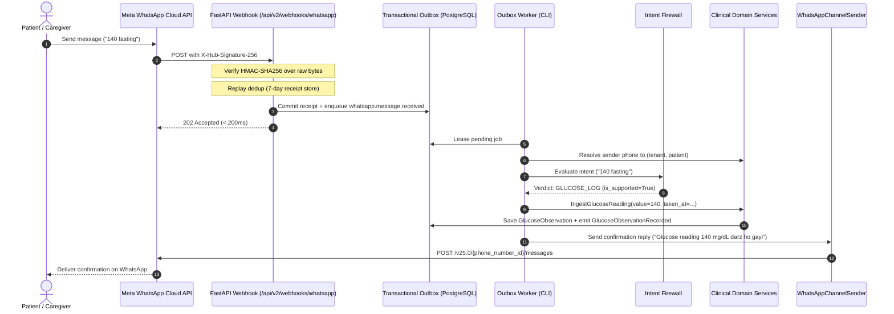

# WhatsApp Integration Architecture Specification

This document details the architectural boundaries, event models, and data flows governing the **THALI × P.L.A.T.E.** Meta WhatsApp Cloud API integration.

---

## 1. Architectural Philosophy: Channel vs. Domain

In THALI × P.L.A.T.E., WhatsApp is **exclusively a communication transport channel**. It is **not** a database, **not** an authorization system, and **not** a clinical authority.

### Core Principles:
1. **Canonical Truth in Domain**: Clinical state (patients, glucose observations, meal drafts, medication schedules) exists only within PostgreSQL protected by Row-Level Security (RLS) and Domain Aggregate Invariants.
2. **Untrusted Ingress**: All inbound WhatsApp messages are treated as completely untrusted input. They must pass HMAC-SHA256 signature verification, replay deduplication, rate limiting, identity resolution, and the Intent Firewall before any domain command is constructed.
3. **No Clinical Bleed in Channel Layer**: Outbound WhatsApp prompts never expose calculated internal clinical metrics (carbohydrate grams, glycemic index categories, AI confidence scores) to patients or caregivers.
4. **Temporal Separation**: The time a message is received by the server (`recorded_at` / `captured_at`) is strictly distinguished from when the reading or meal actually occurred (`taken_at` / `stated_at`).

---

## 2. End-to-End Request & Data Lifecycle



---

## 3. Intent Firewall Protection

Incoming messages pass through the `IntentFirewall` (`backend.infrastructure.parsing.intent_firewall`) before touching domain command handlers:

| Intent Type | Examples | Resolution |
|---|---|---|
| `GLUCOSE_LOG` | `"140 fasting"`, `"sugar 180"`, `"aaj subah 8 am 142"` | Parsed to `IngestGlucoseReading`, taken_at extracted |
| `MEAL_LOG` | `"2 roti dal"`, `"rice and fish"`, `"had idli"` | Parsed to `LogMealDraft`, prompts confirmation |
| `CONFIRM` | `"yes"`, `"haan"`, `"theek hai"`, `"ji haan"` | Confirms latest pending meal draft |
| `CORRECT` | `"correct 3 roti"`, `"portion small"`, `"medium"` | Corrects portion/description of pending draft |
| `CANCEL` | `"cancel"`, `"radd"`, `"chhod do"`, `"cancel meal"` | Rejects/cancels pending meal draft safely |
| `STATUS` | `"status"`, `"summary"`, `"aaj ka sugar"` | Returns latest recorded glucose reading without leaking PHI |
| `HELP` | `"help"`, `"madad"`, `"kaise use karein"` | Returns canned usage guidance |
| `UNSUPPORTED` | `"write a poem"`, `"weather today"`, `"def code():"` | Blocked from domain, returns polite health assistant guidance |

---

## 4. Conversational Confirmation Loop

Meal observations follow a strict human-in-the-loop confirmation state machine:

```text
[Inbound Meal Text]
       │
       ▼
LogMealDraftHandler (State: PENDING)
       │
       ▼
Outbound Confirmation Prompt
("Aapne '2 roti dal' khaya? Kripya confirm karein (YES/Haan ya portion: Small / Medium / Large)")
       │
       ├──► Patient replies "YES" / "Haan" ──► ConfirmMealObservation (State: CONFIRMED)
       │
       ├──► Patient replies "correct s"    ──► ConfirmMealObservation (State: CORRECTED, Katori 150ml)
       │
       └──► Patient replies "cancel"       ──► State: REJECTED (Meal discarded)
```

**Clinical Information Asymmetry Invariant**:
The confirmation prompt strictly echoes the food description and portion size. It **never** displays estimated carbs or glycemic index metrics, avoiding patient anxiety and anchoring bias.

---

## 5. Stated-Time Extraction & Domain Timing

The parser extracts relative and categorical time expressions:
- `"aaj subah"` / `"aj shokale"`: Anchor to today at `08:00`
- `"dopahar"` / `"afternoon"`: Anchor to today at `13:00`
- `"shaam"` / `"evening"`: Anchor to today at `18:00`
- `"kal raat"` / `"yesterday night"`: Anchor to yesterday at `21:00`
- Explicit hour expressions (`"8 am"`, `"8:30 pm"`, `"8 baje"`): Anchor to the exact specified hour/minute

The resulting timestamp is recorded as `taken_at` on `GlucoseObservation`, while `created_at` records the exact server ingestion timestamp.
